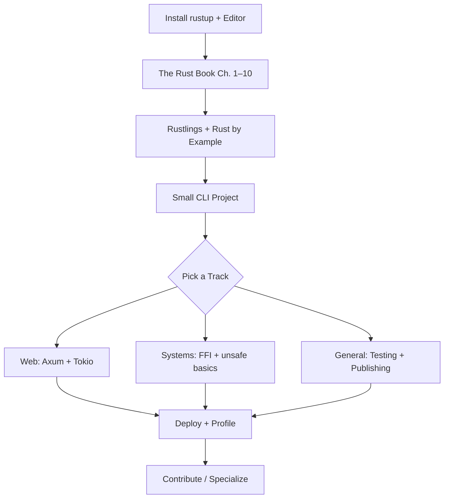
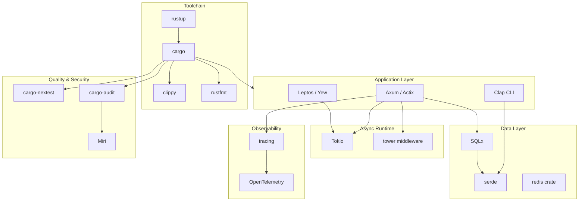

<div align="center">

# 🦀 Awesome Rust

**A curated, opinionated guide to learning, building, and shipping with Rust — from ownership basics to async systems programming.**

[](https://github.com/sindresorhus/awesome)
[](https://github.com/kirtiramchandani/awesome-resources)
[](https://github.com/kirtiramchandani/awesome-rust/stargazers)
[](https://github.com/kirtiramchandani/awesome-rust/network/members)
[](https://github.com/kirtiramchandani/awesome-rust/pulls)
[](https://creativecommons.org/publicdomain/zero/1.0/)
[](https://github.com/kirtiramchandani/awesome-rust)

*Part of the [Awesome Resources](https://github.com/kirtiramchandani/awesome-resources) ecosystem — focused lists, zero overwhelm.*

[Start Here](#-start-here) · [Why Rust](#-why-rust) · [Learning Path](#-learning-path) · [Top 50](#-top-50-must-have) · [Contributing](#-contributing)

</div>

---

## ✨ What Is This?

**Awesome Rust** is a standalone, topic-focused list within the [Awesome Resources](https://github.com/kirtiramchandani/awesome-resources) hub. It collects high-quality Rust learning materials, official references, crates, frameworks, and communities — organized so you can go deep without drowning in links.

| This list **is** | This list **is not** | Tags |
| --- | --- | --- |
| 🎯 A curated map of Rust's core ecosystem | 📦 A mirror of crates.io or every GitHub repo tagged `rust` | 📘 ✅ |
| 🛤️ A learning path from beginner to advanced | 📋 A wholesale copy of rust-unofficial/awesome-rust | 🛠 📘 ✅ |
| 🔗 Canonical links to official docs and trusted sources | 🔍 A substitute for reading crate documentation on docs.rs | 🌐 ⚡ 📘 ✅ |
| 📊 Performance-critical services | ⚡ Latency-sensitive backends where GC pauses hurt SLAs | ⚡ 📘 ✅ |
| 🔐 Security tooling author | 🛡️ Parsers, crypto, and sandboxes where memory bugs are unacceptable | 🔐 📘 ✅ |

> **Let the borrow checker teach you. Then build software that cannot forget to free memory.**

---

## 📋 Table of Contents

- [Start Here](#-start-here)
- [Why Rust](#-why-rust)
- [Learning Path](#-learning-path)
- [Top 50 Must-Have](#-top-50-must-have)
- [90-Day Plan](#-90-day-plan)
- [Ecosystem Map](#-ecosystem-map)
- [Tag Legend](#-tag-legend)
- [Official & Docs](#-official--docs)
- [Beginner](#-beginner)
- [Intermediate](#-intermediate)
- [Advanced](#-advanced)
- [Ecosystem & Tools](#-ecosystem--tools)
- [Frameworks](#-frameworks)
- [Testing](#-testing)
- [Performance](#-performance)
- [Security](#-security)
- [Cheat Sheets](#-cheat-sheets)
- [Interview Prep](#-interview-prep)
- [Awesome Lists](#-awesome-lists)
- [Communities](#-communities)
- [Books](#-books)
- [Courses](#-courses)
- [Project Ideas](#-project-ideas)
- [Career](#-career)
- [FAQ](#-faq)
- [Glossary](#-glossary)
- [Common Pitfalls](#-common-pitfalls)
- [Contributing](#-contributing)
- [License](#-license)

---

## 🚀 Start Here

Match your situation to a starting point. Each row links to a section in this README — open only what you need today.

| If you are… | Start with | Why | Tags |
| --- | --- | --- | --- |
| 🆕 **Brand new to programming** | [Beginner](#-beginner) → [The Rust Book](#-official--docs) | Work through Rustlings alongside the Book — ownership clicks faster with hands-on drills | 🟢 🛠 📘 ✅ |
| 🔄 **Switching from C/C++** | [Why Rust](#-why-rust) → [Rust by Example](#-official--docs) | You already know memory — focus on safe abstractions and the ownership model | 🟢 📘 ✅ |
| 🌐 **Building a web API or service** | [Frameworks](#-frameworks) → [Testing](#-testing) | Axum or Actix with Tokio covers most async HTTP workloads teams ship today | 🟡 🛠 ✅ |
| ⚙️ **Writing systems or CLI tools** | [Ecosystem & Tools](#-ecosystem--tools) | Clap, serde, and cargo publish patterns appear in nearly every Rust binary project | 🟡 🛠 ✅ |
| 🧪 **Writing reliable code** | [Testing](#-testing) → [Intermediate](#-intermediate) | Built-in `cargo test` plus property testing catches bugs the borrow checker cannot | 🟡 🛠 ✅ |
| 🗺️ **Want a structured roadmap** | [Learning Path](#-learning-path) → [90-Day Plan](#-90-day-plan) | Follow staged paths with weekly deliverables | 📘 ✅ |
| 🎯 **Interview in 4–8 weeks** | [Interview Prep](#-interview-prep) → [Top 50](#-top-50-must-have) | Focus on ownership quizzes and small Exercism problems daily | 🛠 📘 ✅ |
| 🔍 **Looking for more links** | [Awesome Lists](#-awesome-lists) | Use rust-unofficial/awesome-rust for discovery; stay here for curated essentials | 📘 ✅ |
| 🔐 **Security-focused role** | [Security](#-security) → [Advanced](#-advanced) | Miri, cargo-audit, and safe FFI patterns matter before writing `unsafe` in production | 🔴 🔐 ✅ |
| ⚡ **Performance tuning** | [Performance](#-performance) → [Advanced](#-advanced) | Criterion benchmarks and the Performance Book turn hunches into measured wins | 🔴 ⚡ ✅ |
| 🧩 **Embedded / no_std path** | [Official & Docs](#-official--docs) → [Advanced](#-advanced) | Embedded Book plus `core`/`alloc` docs — ownership maps cleanly to register constraints | 🔴 🛠 ✅ |
| 📦 **Publishing crates** | [Intermediate](#-intermediate) → [Project Ideas](#-project-ideas) | API Guidelines and semver discipline before your first `cargo publish` | 🟡 🚀 ✅ |
| 🤝 **Open-source contributor** | [Career](#-career) → [Contributing](#-contributing) | rustc-dev-guide and good-first issues on crates you already depend on | 🔴 🚀 ✅ |
| 🎓 **Self-taught with gaps** | [Cheat Sheets](#-cheat-sheets) → [Common Pitfalls](#-common-pitfalls) | cheats.rs plus pitfall catalog closes syntax holes without rereading the entire Book | 🟡 📘 ✅ |
| 🌍 **WebAssembly target** | [Official & Docs](#-official--docs) → [Frameworks](#-frameworks) | WASM Book after sync fundamentals — second deployment target beyond native binaries | 🟡 🚀 ✅ |
| 📊 **Data pipeline author** | [Ecosystem & Tools](#-ecosystem--tools) → [Intermediate](#-intermediate) | Polars, csv, and serde power CLI ETL tools with predictable memory behavior | 🟡 🛠 ✅ |

**Hub navigation:** This list is one spoke in a larger wheel. When your focus shifts beyond Rust — system design, DevOps, WebAssembly, careers — return to the [Awesome Resources hub](https://github.com/kirtiramchandani/awesome-resources). Related lists: [awesome-c-cpp](https://github.com/kirtiramchandani/awesome-c-cpp) · [awesome-system-design](https://github.com/kirtiramchandani/awesome-system-design) · [awesome-go](https://github.com/kirtiramchandani/awesome-go)

---

## 🦀 Why Rust

Rust combines low-level control with compile-time memory safety. The ownership model eliminates entire classes of bugs — use-after-free, data races, null dereferences — without a garbage collector, which makes it attractive for systems software, high-performance services, and security-sensitive tooling.

### Strengths

| Strength | What it means in practice |
| --- | --- |
| **Memory safety without GC** | Predictable latency — no stop-the-world pauses from a runtime collector |
| **Expressive type system** | Enums, pattern matching, and traits model domain logic with compiler-checked exhaustiveness |
| **Fearless concurrency** | The borrow checker rejects data races at compile time — parallel code with fewer footguns |
| **cargo + crates.io** | Dependency management, testing, benchmarking, and publishing unified in one workflow |
| **Cross-compilation & WASM** | Ship native binaries, embedded firmware, browser modules, and server services from one toolchain |

### Trade-offs to know

| Trade-off | Honest take |
| --- | --- |
| **Steep initial curve** | Ownership, lifetimes, and trait bounds frustrate beginners — budget extra time for the first month |
| **Compile times** | Large projects can be slow to rebuild — use `cargo check`, workspace splits, and mold/sccache when needed |
| **Async complexity** | `async`/`.await` adds Pin, lifetimes, and executor choices — learn sync Rust thoroughly first |
| **Smaller hiring pool than Java/JS** | Demand is growing fast in infra and security, but fewer total openings than mainstream enterprise stacks |

### Where Rust shines

```
Systems & infrastructure  →  OS components, databases, proxies, embedded firmware
Web services              →  High-throughput APIs with Axum, Actix, or Rocket
CLI & developer tools     →  ripgrep, fd, bat — fast, polished binaries users love
WebAssembly               →  Browser and edge modules with near-native performance
Security-sensitive code   →  Parsers, crypto, sandboxes where memory bugs are unacceptable
```

Rust is not the fastest path to a CRUD prototype — but when correctness, performance, and long-term maintainability matter, it earns its learning investment.

---

## 🛤️ Learning Path

Follow one stage at a time. Depth beats breadth: finish a small project at each stage before jumping ahead.

### Path diagram



### Staged roadmap

| Stage | Focus | Time estimate | Key resources in this list |
| --- | --- | --- | --- |
| **0 — Setup** | Install rustup, run `rustc --version`, configure rust-analyzer | 1 hour | [rustup.rs](https://rustup.rs/), [rust-lang.org](https://www.rust-lang.org/) |
| **1 — Fundamentals** | Variables, ownership, borrowing, structs, enums, match | 2–3 weeks | [The Rust Book](#-official--docs), [Rustlings](#-beginner) |
| **2 — Idioms** | Traits, generics, error handling, modules, cargo | 2–3 weeks | [Rust by Example](#-official--docs), [Intermediate](#-intermediate) |
| **3 — First project** | Build a CLI tool or small library end-to-end | 1–2 weeks | [Project Ideas](#-project-ideas), [Ecosystem & Tools](#-ecosystem--tools) |
| **4 — Specialize** | Async web, embedded, WASM, or performance-critical code | 4–8 weeks | [Frameworks](#-frameworks), [Advanced](#-advanced) |
| **5 — Professional habits** | Clippy, CI, benchmarking, docs, open-source contribution | ongoing | [Testing](#-testing), [Career](#-career) |

### Track-specific forks

| Track | After Stage 3, prioritize | Capstone project idea |
| --- | --- | --- |
| **Web developer** | Tokio, Axum, serde, SQLx or Diesel | REST API with auth, integration tests, and a containerized deploy |
| **Systems programmer** | unsafe Rust basics, FFI, benchmarking | Native library with C bindings and documented safety invariants |
| **Tooling author** | Clap, tracing, cross-compilation | Published CLI on crates.io that solves one real developer workflow |
| **Async specialist** | Pin, streams, tower middleware | Concurrent service with backpressure, timeouts, and structured logging |


## ⭐ Top 50 Must-Have

The essentials if you read nothing else. Ordered roughly by learning sequence — skip ahead only when a row's level matches yours.

| # | Resource | Section | Level | Tags |
| --- | --- | --- | --- | --- |
| 1 | The Rust Book | Official & Docs | Beginner | 🟢 ⭐ 🌐 |
| 2 | Rustlings | Beginner | Beginner | 🟢 🛠 ⭐ |
| 3 | Rust by Example | Official & Docs | Beginner | 🟢 🛠 🔥 |
| 4 | docs.rs | Official & Docs | Intermediate | 🟡 🌐 🔥 |
| 5 | Comprehensive Rust (Google) | Beginner | Beginner | 🟢 🛠 🔥 |
| 6 | The Cargo Book | Intermediate | Intermediate | 🟡 ⭐ 🌐 |
| 7 | Rust API Guidelines | Intermediate | Intermediate | 🟡 🌐 📘 |
| 8 | Clippy | Intermediate | Intermediate | 🟡 🌐 ✅ |
| 9 | rust-analyzer | Ecosystem & Tools | Beginner | 🟢 🔥 ⭐ |
| 10 | serde | Intermediate | Intermediate | 🟡 🔥 ⭐ |
| 11 | Tokio Tutorial | Intermediate | Intermediate | 🟡 🛠 🔥 |
| 12 | Axum | Frameworks | Intermediate | 🟡 🔥 ⭐ |
| 13 | SQLx | Frameworks | Intermediate | 🟡 🛠 ⭐ |
| 14 | Rust Design Patterns | Intermediate | Intermediate | 🟡 📘 ⭐ |
| 15 | Testing chapter (Rust Book) | Testing | Beginner | 🟢 ⭐ 🌐 |
| 16 | cargo-nextest | Testing | Intermediate | 🟡 🔥 |
| 17 | The Rustonomicon | Advanced | Advanced | 🔴 📘 ⭐ |
| 18 | Rust Performance Book | Advanced | Advanced | 🔴 📘 🔥 |
| 19 | Async Book | Advanced | Advanced | 🔴 📘 |
| 20 | Programming Rust (O'Reilly) | Books | Intermediate | 🟡 💰 ⭐ |
| 21 | Zero To Production In Rust | Books | Intermediate | 🟡 🚀 ⭐ |
| 22 | Rust Users Forum | Communities | Beginner | 🟢 ⭐ 🌐 |
| 23 | This Week in Rust | Communities | Intermediate | 🟡 🔥 |
| 24 | rust-unofficial/awesome-rust | Awesome Lists | Intermediate | 🟡 🔥 |
| 25 | Rust Cookbook | Beginner | Beginner | 🟢 🛠 |
| 26 | Error Handling (Book Ch. 9) | Intermediate | Intermediate | 🟡 🌐 |
| 27 | tracing | Ecosystem & Tools | Intermediate | 🟡 📦 |
| 28 | Clap | Ecosystem & Tools | Intermediate | 🟡 🔥 |
| 29 | tonic (gRPC) | Frameworks | Intermediate | 🟡 ⭐ |
| 30 | proptest | Testing | Intermediate | 🟡 🛠 |
| 31 | Criterion.rs | Ecosystem & Tools | Advanced | 🔴 🛠 |
| 32 | cargo-deny | Security | Intermediate | 🟡 ✅ |
| 33 | Rust Atomics and Locks | Advanced | Advanced | 🔴 📘 ⭐ |
| 34 | Miri | Advanced | Advanced | 🔴 🛠 |
| 35 | Rust for Rustaceans | Books | Advanced | 🔴 💰 📘 |
| 36 | Rustlings + Book pairing | Courses | Beginner | 🟢 🛠 |
| 37 | Rust Jobs | Career | Intermediate | 🟡 🔥 |
| 38 | Rust Contributor Guide | Career | Advanced | 🔴 🚀 🌐 |
| 39 | Rust WASM Book | Official & Docs | Intermediate | 🟡 🚀 🌐 |
| 40 | Leptos | Frameworks | Intermediate | 🟡 🚀 |
| 41 | Tauri | Frameworks | Intermediate | 🟡 🚀 |
| 42 | reqwest | Frameworks | Intermediate | 🟡 🔥 |
| 43 | Rust Embedded Book | Official & Docs | Advanced | 🔴 🛠 🌐 |
| 44 | insta (snapshots) | Testing | Intermediate | 🟡 🛠 |
| 45 | mold linker | Performance | Advanced | 🔴 📦 |
| 46 | Rust Fuzz Book | Security | Advanced | 🔴 📘 |
| 47 | Awesome Resources Hub | Awesome Lists | Beginner | 🟢 ⭐ |
| 48 | Rust Foundation | Career | Intermediate | 🟡 🌐 |
| 49 | Exercism Rust Track | Beginner | Beginner | 🟢 🛠 |
| 50 | grep clone project | Project Ideas | Beginner | 🟢 🚀 ⭐ |


## 📅 90-Day Plan

A structured quarter for developers with 8–12 hours per week. Adjust pace — depth beats speed.

| Week | Focus | Deliverable | Key sections |
| --- | --- | --- | --- |
| **1–2** | Setup + Book Ch. 1–6 | Rustlings set 1 complete | [Beginner](#-beginner), [Official & Docs](#-official--docs) |
| **3–4** | Ownership + Book Ch. 7–10 | grep clone MVP | [Cheat Sheets](#-cheat-sheets), [Project Ideas](#-project-ideas) |
| **5–6** | Traits, errors, modules | JSON CLI with tests | [Intermediate](#-intermediate) |
| **7–8** | Cargo, Clippy, API guidelines | Refactor into library + binary crate | [Ecosystem & Tools](#-ecosystem--tools) |
| **9–10** | Tokio + Axum basics | Todo REST API | [Frameworks](#-frameworks) |
| **11** | SQLx + migrations | Persistent API with integration tests | [Testing](#-testing) |
| **12** | Performance profiling | Criterion benchmark report on one endpoint | [Performance](#-performance) |
| **13** | Security basics | cargo-audit + cargo-deny in CI | [Security](#-security) |

**After 90 days:** Pick a specialization track from [Learning Path](#-learning-path), start [Interview Prep](#-interview-prep), and contribute one doc fix or small PR to a crate you use.

### Weekly rhythm template

| Day | Activity | Duration |
| --- | --- | --- |
| Mon | Read one Book chapter + notes | 1–2 hrs |
| Tue | Rustlings or Exercism exercises | 1 hr |
| Wed | Project feature work | 2 hrs |
| Thu | Read docs.rs for crates used | 1 hr |
| Fri | Tests + Clippy cleanup | 1 hr |
| Sat | Deep dive (video, book chapter) | 2 hrs |
| Sun | Rest or optional community reading | 0–1 hr |


## 🌐 Ecosystem Map

How major Rust pieces connect in a typical backend service. Use this map when choosing crates — not every project needs every box.



**Hub link:** Return to [https://github.com/kirtiramchandani/awesome-resources](https://github.com/kirtiramchandani/awesome-resources) when your stack spans languages — Java services, SQL tuning, and system design lists live there too.


---

## 🏷️ Tag Legend

Tags appear in the **Tags** column of every resource table. Combine them to scan quickly for fit.

| Tag | Meaning |
| --- | --- |
| 🟢 | Beginner-friendly — minimal prerequisites |
| 🟡 | Intermediate — assumes comfortable Rust basics |
| 🔴 | Advanced — deep internals or expert-level material |
| 🆓 | Free to access |
| 💰 | Paid or primarily paid |
| 🛠 | Hands-on — exercises, labs, or project work |
| 📘 | Theory-heavy — concepts, language semantics, architecture |
| 🚀 | Project-based — build something end-to-end |
| ⭐ | Must-read — widely recommended anchor resource |
| 🔥 | Popular — large community adoption or high traffic |
| 🌐 | Official source — maintained by the Rust team or project owners |
| 📦 | Open source — source code freely available |
| ✅ | Verified — stable, actively maintained, canonical link |

**Level column values:** `Beginner`, `Intermediate`, `Advanced`  
**Cost column values:** `Free`, `Paid`, `Freemium`, `Open Source`

---

## 📚 Official & Docs

Start here for authoritative answers. When docs and blog posts disagree, trust these sources first.

| Resource | Type | Level | Cost | Why it matters | Tags |
| --- | --- | --- | --- | --- | --- |
| [rust-lang.org](https://www.rust-lang.org/) | Official site | Beginner | Free | Home for downloads, learning resources, governance, and community links — bookmark this first. | 🟢 🆓 🌐 ⭐ |
| [The Rust Programming Language (Book)](https://doc.rust-lang.org/book/) | Book (online) | Beginner | Free | The canonical narrative guide — read sequentially for the clearest mental model of ownership and traits. | 🟢 🆓 🌐 ⭐ |
| [Rust by Example](https://doc.rust-lang.org/rust-by-example/) | Reference | Beginner | Free | Runnable examples for every major feature — ideal alongside the Book when you learn by reading code. | 🟢 🆓 🌐 🛠 🔥 |
| [The Rust Reference](https://doc.rust-lang.org/reference/) | Reference | Advanced | Free | Formal language specification — consult when compiler errors reference subtle semantics. | 🔴 🆓 🌐 📘 |
| [Standard library docs (std)](https://doc.rust-lang.org/std/) | API reference | Intermediate | Free | Authoritative documentation for built-in types and traits — every Rust developer lives here daily. | 🟡 🆓 🌐 ⭐ |
| [docs.rs](https://docs.rs/) | API reference | Intermediate | Free | Hosted documentation for every published crate — the canonical browser for third-party library APIs. | 🟡 🆓 🌐 🔥 |
| [Rust Edition Guide](https://doc.rust-lang.org/edition-guide/) | Guide | Intermediate | Free | Explains changes across Rust editions — essential when migrating codebases or reading older tutorials. | 🟡 🆓 🌐 |
| [Rust RFC Book](https://rust-lang.github.io/rfcs/) | Reference | Advanced | Free | Design proposals and accepted RFCs — context for why language features exist and how they may evolve. | 🔴 🆓 🌐 📘 |
| [Rust Compiler Development Guide](https://rustc-dev-guide.rust-lang.org/) | Guide | Advanced | Free | How rustc is structured and how to contribute — invaluable when compiler errors feel opaque. | 🔴 🆓 🌐 📘 |
| [Rust Style Guide](https://doc.rust-lang.org/nightly/style-guide/) | Guide | Intermediate | Free | Community formatting conventions beyond rustfmt defaults — useful when reviewing team PRs. | 🟡 🆓 🌐 |
| [Rust Embedded Book](https://docs.rust-embedded.org/book/) | Book (online) | Advanced | Free | Embedded Rust patterns on microcontrollers — ownership maps cleanly to register and DMA constraints. | 🔴 🆓 🌐 🛠 |
| [Rust WASM Book](https://rustwasm.github.io/docs/book/) | Book (online) | Intermediate | Free | Compile Rust to WebAssembly for browsers and edge — second deployment target after native binaries. | 🟡 🆓 🌐 🚀 |
| [Rustdoc Book](https://doc.rust-lang.org/rustdoc/) | Docs | Intermediate | Free | How to write crate documentation that appears on docs.rs — doctest examples catch API drift early. | 🟡 🆓 🌐 |
| [Rust Playground FAQ](https://play.rust-lang.org/help) | Docs | Beginner | Free | Explains playground limits, edition flags, and sharing — quick reference when demos fail mysteriously. | 🟢 🆓 🌐 |
| [Release Notes](https://blog.rust-lang.org/) | Blog | Intermediate | Free | Official release announcements with migration notes — read before upgrading toolchain in CI. | 🟡 🆓 🌐 🔥 |
| [Rust Security Response](https://www.rust-lang.org/policies/security) | Policy | Intermediate | Free | How the project handles CVEs in the toolchain and ecosystem — baseline for supply-chain awareness. | 🟡 🆓 🌐 ✅ |
| [Learn Rust (rust-lang.org/learn)](https://www.rust-lang.org/learn) | Guide | Beginner | Free | Curated entry points for newcomers — official roadmap linking Book, Rustlings, and community resources. | 🟢 🆓 🌐 ⭐ |
| [The Unstable Book](https://doc.rust-lang.org/unstable-book/) | Reference | Advanced | Free | Documents nightly-only features — consult before enabling unstable flags in production-bound crates. | 🔴 🆓 🌐 📘 |
| [The clippy book](https://doc.rust-lang.org/clippy/) | Guide | Intermediate | Free | How lints are categorized and how to allow or fix them — pairs with `cargo clippy` in daily workflow. | 🟡 🆓 🌐 ✅ |
| [Error Index](https://doc.rust-lang.org/error-index.html) | Reference | Intermediate | Free | Searchable catalog of rustc error codes with explanations — faster than guessing from error snippets alone. | 🟡 🆓 🌐 |
| [Cargo Reference](https://doc.rust-lang.org/cargo/reference/) | Reference | Intermediate | Free | Deep manifest syntax, profiles, and resolver behavior — consult when Cargo.toml surprises your team. | 🟡 🆓 🌐 |
| [Rust Governance](https://www.rust-lang.org/governance) | Policy | Intermediate | Free | Team structure and decision-making process — context for RFCs and language evolution timelines. | 🟡 🆓 🌐 |
| [Inside Rust Blog](https://blog.rust-lang.org/inside-rust/) | Blog | Advanced | Free | Compiler, library, and process updates from maintainers — early signal for ecosystem direction. | 🔴 🆓 🌐 |
| [Rust Project Goals](https://rust-lang.github.io/rust-project-goals/) | Guide | Intermediate | Free | Tracked initiatives like async traits and std improvements — see where the language is heading next. | 🟡 🆓 🌐 |
| [Core library (core)](https://doc.rust-lang.org/core/) | API reference | Advanced | Free | no_std foundation types and traits — required reading for embedded and kernel-adjacent work. | 🔴 🆓 🌐 📘 |
| [Alloc crate docs](https://doc.rust-lang.org/alloc/) | API reference | Advanced | Free | Heap allocation types without full std — bridges embedded and general-purpose Rust codebases. | 🔴 🆓 🌐 |
| [Procedural Macros reference](https://doc.rust-lang.org/reference/procedural-macros.html) | Reference | Advanced | Free | Official semantics for derive and attribute macros — baseline before authoring proc-macro crates. | 🔴 🆓 🌐 📘 |
| [Standard library source viewer](https://doc.rust-lang.org/src/) | Reference | Advanced | Free | Browse stdlib implementation on docs.rs-style pages — see how Vec and HashMap actually work. | 🔴 🆓 🌐 🛠 |
| [Trait Objects chapter (Book ch. 17)](https://doc.rust-lang.org/book/ch17-00-oop.html) | Docs | Intermediate | Free | Dynamic dispatch, trait objects, and OOP patterns in Rust — clarifies when vtables beat generics. | 🟡 🆓 🌐 📘 |
| [Advanced Traits chapter (Book ch. 19)](https://doc.rust-lang.org/book/ch19-03-advanced-traits.html) | Docs | Advanced | Free | Associated types, HRTBs, and bounded impls — unlocks reading production library signatures. | 🔴 🆓 🌐 📘 |
| [Rust community page](https://www.rust-lang.org/community) | Directory | Beginner | Free | Official map of forums, chat, and events — single page to bookmark for help channels. | 🟢 🆓 🌐 |
| [Foundation policies](https://foundation.rust-lang.org/policies/) | Policy | Intermediate | Free | Trademark, privacy, and security policies — reference for enterprise legal review of Rust adoption. | 🟡 🆓 🌐 ✅ |
| [Rust Forge](https://forge.rust-lang.org/) | Guide | Intermediate | Free | Central hub for release process, infrastructure, and team workflows — navigate beyond user-facing rust-lang.org pages. | 🟡 🆓 🌐 |
| [Cargo Getting Started](https://doc.rust-lang.org/cargo/getting-started/) | Guide | Beginner | Free | First-project walkthrough from `cargo new` through build and run — complements the Book before diving into manifest syntax. | 🟢 🆓 🌐 🛠 |
| [Rustc codegen options](https://doc.rust-lang.org/rustc/codegen-options/index.html) | Reference | Advanced | Free | `-C opt-level`, LTO, and target-cpu flags documented — consult when release binaries underperform expectations. | 🔴 🆓 🌐 ⚡ |
| [Conditional compilation](https://doc.rust-lang.org/reference/conditional-compilation.html) | Reference | Intermediate | Free | `cfg`, target triples, and feature gates — essential when one crate supports Linux, Windows, and WASM targets. | 🟡 🆓 🌐 📘 |
| [Attributes reference](https://doc.rust-lang.org/reference/attributes.html) | Reference | Advanced | Free | Built-in attribute catalog from `#[inline]` to `#[repr(C)]` — baseline before authoring custom proc-macro attributes. | 🔴 🆓 🌐 📘 |
| [Const evaluation](https://doc.rust-lang.org/reference/const_eval.html) | Reference | Advanced | Free | Rules for compile-time computation — unlocks const generics and static assertions in library public APIs. | 🔴 🆓 🌐 📘 |
| [Linkage reference](https://doc.rust-lang.org/reference/linkage.html) | Reference | Advanced | Free | Symbol visibility and linking behavior across crates — critical when building `cdylib` or static libraries for FFI. | 🔴 🆓 🌐 📘 |
| [Rustc lints listing](https://doc.rust-lang.org/rustc/lints/index.html) | Reference | Advanced | Free | Compiler lint groups with allow/warn/deny controls — tune `-D warnings` policies for stricter team CI pipelines. | 🔴 🆓 🌐 |
| [Platform support tiers](https://doc.rust-lang.org/nightly/rustc/platform-support.html) | Reference | Intermediate | Free | Tier 1/2/3 target matrix — set expectations before committing to exotic embedded or proprietary OS triples. | 🟡 🆓 🌐 |
| [Useful dev tools (Book appendix)](https://doc.rust-lang.org/book/appendix-04-useful-development-tools.html) | Docs | Beginner | Free | Official overview of rustfmt, Clippy, and rust-analyzer — confirms toolchain components to install via rustup. | 🟢 🆓 🌐 ✅ |
| [Rustdoc lints](https://doc.rust-lang.org/rustdoc/lints.html) | Reference | Intermediate | Free | Warn on broken intra-doc links and missing docs — keeps published crate documentation trustworthy on docs.rs. | 🟡 🆓 🌐 |
| [Rustdoc intra-doc links](https://doc.rust-lang.org/rustdoc/write-documentation/linking-to-items-by-name.html) | Guide | Intermediate | Free | Link types and functions across modules in markdown docs — reduces broken links when APIs get reorganized. | 🟡 🆓 🌐 🛠 |
| [Cargo commands index](https://doc.rust-lang.org/cargo/commands/) | Reference | Intermediate | Free | Complete CLI reference for build, test, publish, and vendor — consult when flags behave differently in CI vs locally. | 🟡 🆓 🌐 |
| [Stability attributes](https://doc.rust-lang.org/reference/stability.html) | Reference | Advanced | Free | Deprecation and stability markers for evolving APIs — communicate semver-safe evolution to downstream consumers. | 🔴 🆓 🌐 📘 |
| [Visibility and privacy](https://doc.rust-lang.org/reference/visibility-and-privacy.html) | Reference | Intermediate | Free | `pub(crate)`, `pub(super)`, and re-export rules — document only what you intend as stable public surface area. | 🟡 🆓 🌐 📘 |
| [Custom target specs](https://doc.rust-lang.org/nightly/rustc/targets/custom.html) | Reference | Advanced | Free | JSON target definitions for bare-metal builds — embedded teams use this for chip-specific triples without upstream support. | 🔴 🆓 🌐 📘 |
| [Rustdoc scrape examples](https://doc.rust-lang.org/nightly/rustdoc/scrape-examples.html) | Guide | Advanced | Free | Collect runnable examples from the codebase into generated docs — improves onboarding for large library crates. | 🔴 🆓 🌐 |
| [Testing appendix (Book)](https://doc.rust-lang.org/book/ch11-00-testing.html) | Docs | Beginner | Free | Official testing chapter entry point — cross-links unit, integration, and doc test organization patterns. | 🟢 🆓 🌐 ⭐ |
| [Rustdoc README inclusion](https://doc.rust-lang.org/rustdoc/write-documentation/the-doc-attribute.html) | Guide | Intermediate | Free | `#![doc = include_str!(\"../README.md\")]` pattern — single source of truth for crate landing pages on docs.rs. | 🟡 🆓 🌐 🛠 |
| [MSRV policy (RFC 2495)](https://rust-lang.github.io/rfcs/2495-min-rust-version.html) | Reference | Intermediate | Free | Minimum supported Rust version conventions — set `rust-version` in Cargo.toml with team-wide policy clarity. | 🟡 🆓 🌐 📘 |
| [Rustdoc compile-fail tests](https://doc.rust-lang.org/rustdoc/write-documentation/documentation-tests.html#attributes) | Guide | Intermediate | Free | Document expected compiler errors in doc tests — teach correct API usage by showing what fails and why. | 🟡 🆓 🌐 🛠 |
| [Rustdoc item sorting](https://doc.rust-lang.org/rustdoc/write-documentation/what-to-include.html) | Guide | Intermediate | Free | Control section ordering in generated HTML — present APIs in teaching order rather than strict alphabetical sort. | 🟡 🆓 🌐 |
| [Rustdoc search optimization](https://doc.rust-lang.org/rustdoc/read-documentation/search.html) | Docs | Intermediate | Free | How docs.rs search indexes symbols — name public types clearly so consumers find them without guessing module paths. | 🟡 🆓 🌐 |
| [Rustdoc feature documentation](https://doc.rust-lang.org/cargo/reference/features.html#documentation) | Guide | Intermediate | Free | Document optional Cargo features and their interactions — prevents surprise compile errors when consumers enable flags. | 🟡 🆓 🌐 |
| [Rustdoc missing_docs lint](https://doc.rust-lang.org/rustdoc/lints.html#missing_docs) | Reference | Intermediate | Free | Enforce documentation on all public items — pair with `#![warn(missing_docs)]` in library crate roots from day one. | 🟡 🆓 🌐 ✅ |
| [Rustdoc playground flags](https://doc.rust-lang.org/rustdoc/write-documentation/documentation-tests.html) | Guide | Intermediate | Free | Edition and extern crate flags on runnable examples — verify snippets compile before publishing to docs.rs. | 🟡 🆓 🌐 🛠 |
| [Rustdoc external file tests](https://doc.rust-lang.org/rustdoc/write-documentation/documentation-tests.html#include-files-as-tests) | Guide | Intermediate | Free | Embed external `.rs` files as doctests — keeps long examples maintainable outside bloated doc comments. | 🟡 🆓 🌐 🛠 |
| [Rustdoc type layout flag](https://doc.rust-lang.org/nightly/unstable-book/compiler-flags/report-type-layout.html) | Reference | Advanced | Free | `--print=type-layout` for repr and alignment — debug FFI struct packing before shipping C-compatible bindings. | 🔴 🆓 🌐 📘 |
| [Rustdoc module-level docs](https://doc.rust-lang.org/rustdoc/write-documentation/what-to-include.html) | Guide | Intermediate | Free | Module overview sections with `# Examples` — set architectural context before readers dive into individual functions. | 🟡 🆓 🌐 |
| [Rustdoc `--doc` CI testing](https://doc.rust-lang.org/rustdoc/write-documentation/documentation-tests.html) | Guide | Intermediate | Free | Run `cargo test --doc` in CI pipelines — catches stale examples that fail to compile after API refactors. | 🟡 🆓 🌐 🛠 ✅ |
| [Rustdoc re-export patterns](https://doc.rust-lang.org/reference/items/use-declarations.html) | Reference | Intermediate | Free | `pub use` for ergonomic crate roots — flatten deep module trees without hiding internal implementation details. | 🟡 🆓 🌐 📘 |
| [Rustdoc custom CSS themes](https://doc.rust-lang.org/rustdoc/read-documentation/how-to-read-rustdoc.html) | Docs | Intermediate | Free | Theme and layout customization for self-hosted docs — brand internal crates without forking the default docs.rs styling. | 🟡 🆓 🌐 |

---

## 🌱 Beginner

Materials that assume no prior Rust experience. Pair reading with Rustlings exercises for faster progress.

| Resource | Type | Level | Cost | Why it matters | Tags |
| --- | --- | --- | --- | --- | --- |
| [Rustlings](https://github.com/rust-lang/rustlings) | Exercises | Beginner | Free | Small programs with failing tests that teach syntax and ownership — the community standard first drill set. | 🟢 🆓 📦 🛠 ⭐ |
| [Exercism — Rust Track](https://exercism.org/tracks/rust) | Exercises | Beginner | Free | Mentored practice problems with automated tests — reinforces Book chapters through repetition. | 🟢 🆓 🛠 |
| [Rust Playground](https://play.rust-lang.org/) | Tool | Beginner | Free | Compile and share snippets in the browser — experiment with types without a local project. | 🟢 🆓 🌐 🛠 |
| [Installation via rustup](https://www.rust-lang.org/tools/install) | Docs | Beginner | Free | Official installer for stable, beta, and nightly toolchains — verify with `rustc --version` before proceeding. | 🟢 🆓 🌐 ✅ |
| [Comprehensive Rust (Google)](https://google.github.io/comprehensive-rust/) | Course | Beginner | Free | Multi-day class material covering ownership through Android — dense but free and classroom-tested. | 🟢 🆓 🛠 🔥 |
| [Rust Crash Course (freeCodeCamp)](https://www.youtube.com/watch?v=zF34dRivLOw) | Video | Beginner | Free | Single-session overview for developers with prior programming experience — good preview before committing to the Book. | 🟢 🆓 |
| [Rustlings Solutions Discussions](https://github.com/rust-lang/rustlings/discussions) | Community | Beginner | Free | Peer explanations for stuck exercises — read after attempting yourself to preserve learning. | 🟢 🆓 📦 |
| [Tour of Rust](https://tourofrust.com/) | Tutorial | Beginner | Free | Interactive syntax tour in the browser — fast orientation before diving into the Book. | 🟢 🆓 🛠 |
| [Rust Cookbook](https://rust-lang-nursery.github.io/rust-cookbook/) | Recipes | Beginner | Free | Task-oriented snippets for common problems — copy patterns for CLI parsing, HTTP, and file I/O. | 🟢 🆓 📦 🛠 |
| [Rustlings GitHub Classroom](https://github.com/rust-lang/rustlings#runnable-exercises) | Exercises | Beginner | Free | Official pairing guide linking Book chapters to Rustlings exercises — structured weekly pacing. | 🟢 🆓 🛠 ⭐ |
| [Sololearn Rust](https://www.sololearn.com/en/learn/courses/rust-introduction) | Course | Beginner | Freemium | Mobile-friendly micro-lessons — supplementary when you have five-minute gaps between meetings. | 🟢 🆓 💰 |
| [Rust Beginner Notes (Sheshbabu)](https://github.com/sheshbabu/notes) | Notes | Beginner | Free | Concise chapter summaries aligned with the Book — quick review before exercises. | 🟢 🆓 📦 |
| [Easy Rust](https://github.com/Dhghomon/easy_rust) | Book (online) | Beginner | Free | Gentle narrative with mnemonics and images — alternative voice when the official Book feels dense. | 🟢 🆓 📦 📘 |
| [Rust by Practice](https://practice.rs/) | Exercises | Beginner | Free | Topic-indexed drills covering syntax through modules — good companion after Rustlings set one. | 🟢 🆓 🛠 🔥 |
| [100 Exercises To Learn Rust](https://github.com/mainmatter/100-exercises-to-learn-rust) | Exercises | Beginner | Free | Mainmatter curriculum with progressive workshops — classroom-tested structure used in corporate training. | 🟢 🆓 📦 🛠 ⭐ |
| [No Boilerplate (YouTube)](https://www.youtube.com/c/NoBoilerplate) | Video | Beginner | Free | Short, opinionated explainers on Rust concepts and ecosystem news — high signal per minute. | 🟢 🆓 |
| [Jon Gjengset — Crust of Rust (YouTube)](https://www.youtube.com/playlist?list=PLqbS7AVVErFiWDOAVrPt7jaYmFx45xfcP) | Video | Intermediate | Free | Deep dives into Arc, Pin, and iterators — watch after basics when standard tutorials stop helping. | 🟡 🆓 📘 |
| [Rust Viz (ownership diagrams)](https://rustviz.org/) | Tool | Beginner | Free | Visualizes borrow and move events in simple programs — clarifies ownership before advanced lifetimes. | 🟢 🆓 🛠 |
| [rust-learning (ctjhoa)](https://github.com/ctjhoa/rust-learning) | Awesome list | Beginner | Free | Community index of tutorials and tools — supplementary discovery beyond this curated list. | 🟢 🆓 📦 |
| [Microsoft Learn — Rust First Steps](https://learn.microsoft.com/en-us/training/paths/rust-first-steps/) | Course | Beginner | Free | Short official Microsoft modules with sandbox exercises — low friction for Windows-centric developers. | 🟢 🆓 🛠 |
| [Rust Koans](https://github.com/crazymykl/rust-koans) | Exercises | Beginner | Free | Test-driven enlightenment through failing assertions — iterative path to idiomatic patterns. | 🟢 🆓 📦 🛠 |
| [Advent of Code](https://adventofcode.com/) | Exercises | Beginner | Free | Annual puzzles where Rust shines for parsing and performance — community write-ups teach idiomatic iteration. | 🟢 🆓 🚀 |
| [Faster Than Lime articles](https://fasterthanli.me/) | Articles | Beginner | Free | Long-form blog posts demystifying strings, async, and tooling — readable prose with runnable examples. | 🟢 🆓 📘 🔥 |
| [Rust in Replit template](https://replit.com/languages/rust) | Tool | Beginner | Freemium | Browser-based Rust environment — scratchpad when you cannot install rustup locally. | 🟢 🆓 💰 🛠 |
| [Rust Book translated (community)](https://github.com/rust-lang/book/tree/master/book) | Book (online) | Beginner | Free | Official Book repository with links to community translations — learn in your native language when available. | 🟢 🆓 🌐 |
| [Rust Study (Discord community)](https://discord.gg/rust-lang) | Community | Beginner | Free | `#beginners` channel on official Discord — real-time help when forum search does not surface your error. | 🟢 🆓 🔥 |
| [Rustlings install guide](https://github.com/rust-lang/rustlings#getting-started) | Docs | Beginner | Free | Step-by-step setup including `rustlings watch` workflow — avoids the common mistake of skipping verification steps. | 🟢 🆓 📦 🛠 |
| [Rust Playground share links](https://play.rust-lang.org/) | Tool | Beginner | Free | Permalink snippets for forum questions — include minimal reproducible examples when asking for borrow-checker help. | 🟢 🆓 🌐 🛠 |
| [Rust Book Ch. 3 exercises mindset](https://doc.rust-lang.org/book/ch03-00-common-programming-concepts.html) | Docs | Beginner | Free | Variables, functions, and control flow before ownership — do not skip this chapter even if syntax feels familiar. | 🟢 🆓 🌐 |
| [Rust Book Ch. 4 ownership](https://doc.rust-lang.org/book/ch04-00-understanding-ownership.html) | Docs | Beginner | Free | The chapter that defines Rust — reread until moves, borrows, and slices feel natural before advancing. | 🟢 🆓 🌐 ⭐ |
| [Rustlings ownership track](https://github.com/rust-lang/rustlings/tree/main/exercises/06_move_semantics) | Exercises | Beginner | Free | Dedicated move-semantics drills — hands-on reinforcement immediately after Book chapter four. | 🟢 🆓 📦 🛠 |
| [Rust Book Ch. 5 structs](https://doc.rust-lang.org/book/ch05-00-structs.html) | Docs | Beginner | Free | Struct definitions, tuple structs, and method syntax — foundation for modeling domain types idiomatically. | 🟢 🆓 🌐 |
| [Rustlings struct exercises](https://github.com/rust-lang/rustlings/tree/main/exercises/07_structs) | Exercises | Beginner | Free | Struct and method drills with failing tests — bridges Book chapter five into muscle memory. | 🟢 🆓 📦 🛠 |
| [Rust Book Ch. 6 enums](https://doc.rust-lang.org/book/ch06-00-enums.html) | Docs | Beginner | Free | Enums, Option, and match — the expressive heart of Rust error handling and state machines. | 🟢 🆓 🌐 ⭐ |
| [Rustlings enum exercises](https://github.com/rust-lang/rustlings/tree/main/exercises/08_enums) | Exercises | Beginner | Free | Enum and match drills — practice exhaustive matching before intermediate error-handling chapters. | 🟢 🆓 📦 🛠 |
| [Rust Book Ch. 8 collections](https://doc.rust-lang.org/book/ch08-00-common-collections.html) | Docs | Beginner | Free | Vec, String, and HashMap usage patterns — daily data structures every Rust project depends on. | 🟢 🆓 🌐 |
| [Rustlings hashmap exercises](https://github.com/rust-lang/rustlings/tree/main/exercises/09_hashmaps) | Exercises | Beginner | Free | HashMap insertion and iteration drills — reinforces ownership rules when storing owned keys and values. | 🟢 🆓 📦 🛠 |
| [Rustlings error exercises](https://github.com/rust-lang/rustlings/tree/main/exercises/12_options) | Exercises | Beginner | Free | Option and Result drills before Book chapter nine — builds error-handling reflexes early. | 🟢 🆓 📦 🛠 |
| [Rust Book Ch. 2 guessing game](https://doc.rust-lang.org/book/ch02-00-guessing-game-tutorial.html) | Tutorial | Beginner | Free | First complete program with stdin, loops, and crates.io — end-to-end project before ownership deep dive. | 🟢 🆓 🌐 🚀 |
| [Rust Book Ch. 1 hello world](https://doc.rust-lang.org/book/ch01-02-hello-world.html) | Tutorial | Beginner | Free | Minimal compile-run cycle — confirms toolchain works before investing hours in later chapters. | 🟢 🆓 🌐 |
| [Rustlings intro exercises](https://github.com/rust-lang/rustlings/tree/main/exercises/00_intro) | Exercises | Beginner | Free | Environment verification exercises — catches misconfigured PATH or missing rustup components immediately. | 🟢 🆓 📦 🛠 |
| [Rustlings variables exercises](https://github.com/rust-lang/rustlings/tree/main/exercises/01_variables) | Exercises | Beginner | Free | Mutability and shadowing drills — reinforces Book chapter three concepts through failing tests. | 🟢 🆓 📦 🛠 |
| [Rustlings functions exercises](https://github.com/rust-lang/rustlings/tree/main/exercises/02_functions) | Exercises | Beginner | Free | Function signature and return type practice — builds confidence before struct method syntax. | 🟢 🆓 📦 🛠 |
| [Rustlings if exercises](https://github.com/rust-lang/rustlings/tree/main/exercises/03_if) | Exercises | Beginner | Free | Conditional expression drills — Rust if blocks return values, unlike C-style statement-only branches. | 🟢 🆓 📦 🛠 |
| [Rustlings quiz exercises](https://github.com/rust-lang/rustlings/tree/main/exercises/04_primitive_types) | Exercises | Beginner | Free | Primitive type conversions and literals — catches integer overflow and type inference surprises early. | 🟢 🆓 📦 🛠 |
| [Rustlings vecs exercises](https://github.com/rust-lang/rustlings/tree/main/exercises/05_vecs) | Exercises | Beginner | Free | Vector push, pop, and iteration drills — ownership patterns with growable collections in practice. | 🟢 🆓 📦 🛠 |
| [Rustlings modules exercises](https://github.com/rust-lang/rustlings/tree/main/exercises/15_modules) | Exercises | Beginner | Free | Module visibility and `use` path drills — prepares for splitting projects into library and binary crates. | 🟢 🆓 📦 🛠 |
| [Rustlings threads intro](https://github.com/rust-lang/rustlings/tree/main/exercises/16_threads) | Exercises | Beginner | Free | Basic thread spawning exercises — gentle introduction before intermediate concurrency chapters. | 🟢 🆓 📦 🛠 |

---

## 📈 Intermediate

For developers who can compile working Rust but want idioms, error handling, and async foundations.

| Resource | Type | Level | Cost | Why it matters | Tags |
| --- | --- | --- | --- | --- | --- |
| [The Cargo Book](https://doc.rust-lang.org/cargo/) | Docs | Intermediate | Free | Definitive guide to manifests, workspaces, features, and publishing — required before sharing crates. | 🟡 🆓 🌐 ⭐ |
| [Rust API Guidelines](https://rust-lang.github.io/api-guidelines/) | Guide | Intermediate | Free | Official conventions for public crate APIs — read before publishing libraries others will depend on. | 🟡 🆓 🌐 📘 |
| [Error Handling in Rust](https://doc.rust-lang.org/book/ch09-00-error-handling.html) | Docs | Intermediate | Free | Book chapter on `Result`, `?`, and custom errors — the foundation for robust application code. | 🟡 🆓 🌐 |
| [serde](https://serde.rs/) | Library | Intermediate | Open Source | De-facto serialization framework — JSON, TOML, and binary formats across nearly every Rust project. | 🟡 📦 🔥 ⭐ |
| [Tokio Tutorial](https://tokio.rs/tokio/tutorial) | Tutorial | Intermediate | Free | Official async runtime guide — start here when HTTP services or concurrent I/O enter your projects. | 🟡 🆓 🛠 🔥 |
| [Clippy documentation](https://doc.rust-lang.org/clippy/) | Docs | Intermediate | Free | Built-in linter with hundreds of lints — run `cargo clippy` early to internalize idiomatic patterns. | 🟡 🆓 🌐 ✅ |
| [thiserror / anyhow](https://docs.rs/thiserror/) | Library | Intermediate | Open Source | Ergonomic error types for libraries vs applications — standard pairing in production Rust codebases. | 🟡 📦 🔥 |
| [Rust Design Patterns](https://rust-unofficial.github.io/patterns/) | Guide | Intermediate | Free | Catalog of idiomatic solutions — builder, newtype, and strategy patterns adapted to ownership. | 🟡 🆓 📘 ⭐ |
| [Rust Iterator Patterns](https://doc.rust-lang.org/book/ch13-02-iterators.html) | Docs | Intermediate | Free | Book chapter on iterators and closures — transforms how you write loops and data pipelines. | 🟡 🆓 🌐 🛠 |
| [Pin and Unpin explained](https://docs.rs/pin-project/) | Library | Advanced | Open Source | Macros simplifying Pin usage in async code — bridges gap between tutorials and production services. | 🔴 📦 📘 |
| [Rust Module System](https://doc.rust-lang.org/book/ch07-00-managing-growing-projects-with-packages-crates-and-modules.html) | Docs | Intermediate | Free | Packages, crates, and modules — essential before splitting binaries into reusable libraries. | 🟡 🆓 🌐 |
| [Rustdoc doctest guide](https://doc.rust-lang.org/rustdoc/write-documentation/documentation-tests.html) | Docs | Intermediate | Free | Executable examples in doc comments — keeps public APIs honest as internals evolve. | 🟡 🆓 🌐 🛠 |
| [futures crate](https://docs.rs/futures/) | Library | Intermediate | Open Source | Combinators and utilities layered on core Future — used throughout Tokio ecosystem services. | 🟡 📦 🔥 |
| [anyhow crate](https://docs.rs/anyhow/) | Library | Intermediate | Open Source | Application-layer error handling with context — pairs with thiserror in library vs binary split. | 🟡 📦 🔥 |
| [bytes crate](https://docs.rs/bytes/) | Library | Intermediate | Open Source | Shared, ref-counted byte buffers for network code — standard in hyper, tonic, and Tokio stacks. | 🟡 📦 |
| [crossbeam](https://docs.rs/crossbeam/) | Library | Intermediate | Open Source | Concurrent data structures and scoped threads — ergonomic parallelism before diving into atomics. | 🟡 📦 🛠 |
| [Smart Pointers chapter (Book ch. 15)](https://doc.rust-lang.org/book/ch15-00-smart-pointers.html) | Docs | Intermediate | Free | Box, Rc, Arc, and RefCell explained coherently — foundation for shared-state designs. | 🟡 🆓 🌐 📘 |
| [Generics chapter (Book ch. 10)](https://doc.rust-lang.org/book/ch10-00-generics.html) | Docs | Intermediate | Free | Generics, traits, and lifetimes introduction — reread when trait bounds on functions confuse you. | 🟡 🆓 🌐 ⭐ |
| [Cargo resolver v2](https://doc.rust-lang.org/cargo/reference/resolver.html#resolver-versions) | Docs | Intermediate | Free | Feature unification across workspaces — prevents duplicate dependency versions in large monorepos. | 🟡 🆓 🌐 |
| [OnceLock and LazyLock docs](https://doc.rust-lang.org/std/sync/struct.OnceLock.html) | Docs | Intermediate | Free | Stable one-time initialization without lazy_static — preferred pattern for global singletons. | 🟡 🆓 🌐 |
| [pin-project-lite](https://docs.rs/pin-project-lite/) | Library | Intermediate | Open Source | Lightweight Pin projection macros — simplifies async struct definitions without heavy codegen. | 🟡 📦 |
| [Corrode — Rust for professionals](https://corrode.dev/) | Blog | Intermediate | Free | Practical articles on migration, tooling, and team adoption — bridges enterprise context with Rust idioms. | 🟡 🆓 📘 |
| [Testing module in Cargo book](https://doc.rust-lang.org/cargo/guide/tests.html) | Docs | Intermediate | Free | Integration test layout and feature-gated test dependencies — structure before scaling test suites. | 🟡 🆓 🌐 🛠 |
| [Pattern syntax chapter (Book ch. 18)](https://doc.rust-lang.org/book/ch18-03-pattern-syntax.html) | Docs | Intermediate | Free | Exhaustive matching, `@` bindings, and guards — write safer match arms in domain logic. | 🟡 🆓 🌐 |
| [Rust Iterator cheat sheet (Daniel Keep)](https://danielkeep.github.io/iter-cheatsheet/html/index.html) | Cheat sheet | Intermediate | Free | Quick reference for map, filter, and fold chains — stop rewriting the same iterator patterns from scratch. | 🟡 🆓 🛠 |
| [Rust error crates comparison](https://nick.groenen.me/posts/rust-error-handling/) | Article | Intermediate | Free | Decision tree for thiserror, anyhow, and custom enums — pick the right error strategy per crate layer. | 🟡 🆓 📘 |
| [Tokio channels guide](https://docs.rs/tokio/latest/tokio/sync/index.html) | Docs | Intermediate | Free | mpsc, broadcast, and watch channels — message-passing patterns for async services without shared mutexes. | 🟡 🆓 🌐 🛠 |
| [Tower Service trait](https://docs.rs/tower-service/latest/tower_service/trait.Service.html) | Docs | Advanced | Open Source | Core abstraction behind Axum middleware — understand before writing custom tower layers. | 🔴 🆓 📘 |
| [Rust module visibility deep dive](https://doc.rust-lang.org/book/ch07-05-separating-modules-into-different-files.html) | Docs | Intermediate | Free | Splitting modules across files — essential structure before publishing multi-module library crates. | 🟡 🆓 🌐 |
| [Cargo workspaces guide](https://doc.rust-lang.org/book/ch14-03-cargo-workspaces.html) | Docs | Intermediate | Free | Book chapter on multi-crate repos — shared dependencies and coordinated versioning in monorepos. | 🟡 🆓 🌐 |
| [Rust testing strategies (Book ch. 11)](https://doc.rust-lang.org/book/ch11-03-test-organization.html) | Docs | Intermediate | Free | Unit vs integration test organization — structure test suites before they sprawl across the codebase. | 🟡 🆓 🌐 🛠 |
| [Rust smart pointer patterns](https://doc.rust-lang.org/book/ch15-05-interior-mutability.html) | Docs | Intermediate | Free | RefCell, Cell, and interior mutability — escape hatch when compile-time borrowing cannot model your API. | 🟡 🆓 🌐 📘 |
| [Rust trait bounds (Book ch. 10)](https://doc.rust-lang.org/book/ch10-02-traits.html) | Docs | Intermediate | Free | Trait definitions, implementations, and bounds — reread when generic function signatures confuse you. | 🟡 🆓 🌐 ⭐ |
| [Rust lifetime elision rules](https://doc.rust-lang.org/book/ch10-03-lifetime-syntax.html) | Docs | Intermediate | Free | When the compiler infers lifetimes — reduces annotation noise in common borrowing patterns. | 🟡 🆓 🌐 📘 |
| [Rust closure types (Book ch. 13)](https://doc.rust-lang.org/book/ch13-01-closures.html) | Docs | Intermediate | Free | Fn, FnMut, FnOnce capture semantics — required before writing iterator adapters and thread spawn closures. | 🟡 🆓 🌐 |
| [Rust concurrency chapter (Book ch. 16)](https://doc.rust-lang.org/book/ch16-00-concurrency.html) | Docs | Intermediate | Free | Threads, channels, and shared-state patterns — sync foundation before async executors add complexity. | 🟡 🆓 🌐 🛠 |
| [Rust I/O chapter (Book ch. 12)](https://doc.rust-lang.org/book/ch12-00-an-io-project.html) | Docs | Intermediate | Free | Command-line I/O project building a grep-like tool — practical file handling before async networking. | 🟡 🆓 🌐 🚀 |
| [Rust Cargo publish guide](https://doc.rust-lang.org/cargo/reference/publishing.html) | Docs | Intermediate | Free | crates.io publishing checklist — metadata, licensing, and semver before your first public release. | 🟡 🆓 🌐 🚀 |
| [Rust semver guidelines](https://doc.rust-lang.org/cargo/reference/semver.html) | Reference | Intermediate | Free | What counts as a breaking change in Rust APIs — prevents accidental major bumps on patch releases. | 🟡 🆓 🌐 📘 |
| [Rust doc comments guide](https://doc.rust-lang.org/reference/comments.html) | Reference | Intermediate | Free | `///` vs `//!` and markdown in docs — write documentation that renders cleanly on docs.rs. | 🟡 🆓 🌐 |
| [Rust derive macro ecosystem](https://docs.rs/syn/latest/syn/) | Library | Advanced | Open Source | syn crate for parsing Rust syntax — gateway to understanding how derive macros inspect your types. | 🔴 📦 📘 |
| [Rust pin and unpin (std docs)](https://doc.rust-lang.org/std/pin/index.html) | Docs | Advanced | Free | Pin API reference — consult when async struct fields refuse to move across await points. | 🔴 🆓 🌐 📘 |
| [Rust async trait workaround](https://docs.rs/async-trait/latest/async_trait/) | Library | Intermediate | Open Source | async-trait crate for dyn-compatible async methods — bridge until native async traits stabilize fully. | 🟡 📦 |
| [Rust chrono time handling](https://docs.rs/chrono/latest/chrono/) | Library | Intermediate | Open Source | Date and time parsing with timezone support — standard choice before reaching for system-specific APIs. | 🟡 📦 🔥 |
| [Rust uuid crate](https://docs.rs/uuid/latest/uuid/) | Library | Intermediate | Open Source | UUID generation and parsing — common in API design for resource identifiers and database primary keys. | 🟡 📦 |
| [Rust regex crate guide](https://docs.rs/regex/latest/regex/) | Library | Intermediate | Open Source | Official regex crate with Unicode support — parsing and validation without rolling custom lexers. | 🟡 📦 🔥 |
| [Rust log vs tracing migration](https://docs.rs/tracing/latest/tracing/) | Docs | Intermediate | Free | Structured tracing spans vs flat log lines — migrate observability as services grow beyond prototypes. | 🟡 🆓 🌐 |

---

## 🔬 Advanced

Deep material for unsafe code, performance tuning, compiler internals, and library authors.

| Resource | Type | Level | Cost | Why it matters | Tags |
| --- | --- | --- | --- | --- | --- |
| [The Rustonomicon](https://doc.rust-lang.org/nomicon/) | Book (online) | Advanced | Free | Official guide to unsafe Rust, FFI, and subverting the borrow checker safely — read before writing `unsafe` blocks. | 🔴 🆓 🌐 📘 ⭐ |
| [Asynchronous Programming in Rust](https://rust-lang.github.io/async-book/) | Book (online) | Advanced | Free | Explains executors, `Future`, and Pin — bridges the gap between Tokio tutorials and production async services. | 🔴 🆓 🌐 📘 |
| [The rustc book](https://doc.rust-lang.org/rustc/) | Docs | Advanced | Free | Compiler flags, targets, and LTO — consult when build configuration affects production binaries. | 🔴 🆓 🌐 |
| [Rust Performance Book](https://nnethercote.github.io/perf-book/) | Book (online) | Advanced | Free | Profiling, allocation reduction, and LLVM-friendly patterns — turns benchmarks into measured wins. | 🔴 🆓 📘 🔥 |
| [Too Many Linked Lists](https://rust-unofficial.github.io/too-many-lists/) | Book (online) | Advanced | Free | Implements linked lists in Rust to teach ownership edge cases — painful, illuminating, and memorable. | 🔴 🆓 📘 🛠 |
| [Rust Atomics and Locks](https://marabos.nl/atomics/) | Book (online) | Advanced | Free | Deep dive into memory ordering and lock-free patterns — required before writing concurrent hot paths. | 🔴 🆓 📘 ⭐ |
| [Rust for Linux](https://rust-for-linux.com/) | Project | Advanced | Free | How Rust integrates with the Linux kernel — case study in unsafe boundaries and ABI stability. | 🔴 🆓 📘 |
| [Miri](https://github.com/rust-lang/miri) | Tool | Advanced | Open Source | Undefined-behavior detector for unsafe Rust — run in CI when `unsafe` blocks touch raw pointers. | 🔴 📦 🛠 |
| [Rust Fuzz Book](https://rust-fuzz.github.io/book/) | Guide | Advanced | Free | cargo-fuzz and libFuzzer integration — finds panics and UB in parsers and decoders. | 🔴 🆓 📘 |
| [Rust ABI Guidelines](https://doc.rust-lang.org/reference/abi.html) | Reference | Advanced | Free | Calling conventions across platforms — critical when exporting C-compatible library interfaces. | 🔴 🆓 🌐 📘 |
| [Writing an OS in Rust (phil-opp)](https://os.phil-opp.com/) | Book (online) | Advanced | Free | Bare-metal kernel development on x86_64 — ownership and no_std in the hardest environment. | 🔴 🆓 📘 🛠 ⭐ |
| [Unsafe Code Guidelines](https://rust-lang.github.io/unsafe-code-guidelines/) | Guide | Advanced | Free | Working group recommendations for sound unsafe — reference when reviewing FFI and raw pointer code. | 🔴 🆓 🌐 📘 |
| [Ralf Jung's Blog](https://www.ralfj.de/blog/) | Blog | Advanced | Free | Miri author on aliasing, stacked borrows, and UB — essential reading for unsafe correctness. | 🔴 🆓 📘 |
| [The Chalk book](https://rust-lang.github.io/chalk/book/) | Book (online) | Advanced | Free | How Rust's trait solver works internally — demystifies complex trait bound errors in generic code. | 🔴 🆓 📘 |
| [bindgen User Guide](https://rust-lang.github.io/rust-bindgen/) | Guide | Advanced | Free | Generate Rust FFI bindings from C headers — standard path for integrating legacy libraries. | 🔴 🆓 🌐 🛠 |
| [cxx crate](https://cxx.rs/) | Library | Advanced | Open Source | Safe interop between Rust and C++ — bidirectional bindings without hand-written unsafe glue everywhere. | 🔴 📦 📘 |
| [core::arch intrinsics](https://doc.rust-lang.org/core/core_arch/arch/index.html) | Docs | Advanced | Free | SIMD and platform intrinsics — last resort after portable optimizations are exhausted. | 🔴 🆓 🌐 📘 |
| [hashbrown](https://github.com/rust-lang/hashbrown) | Library | Advanced | Open Source | HashMap implementation powering std collections — study source to understand Swiss-table performance. | 🔴 📦 📘 |
| [Polonius overview](https://rust-lang.github.io/polonius/) | Guide | Advanced | Free | Next-generation borrow checker research — context for future lifetime error improvements. | 🔴 🆓 📘 |
| [rustc-perf guide](https://github.com/rust-lang/rustc-perf/blob/master/docs/guide.md) | Guide | Advanced | Free | Benchmarking the compiler itself — useful when contributing perf improvements to Rust upstream. | 🔴 🆓 📦 |

---

## 🛠 Ecosystem & Tools

Daily-driver utilities that appear in professional Rust workflows.

| Resource | Type | Level | Cost | Why it matters | Tags |
| --- | --- | --- | --- | --- | --- |
| [cargo](https://doc.rust-lang.org/cargo/) | Build tool | Beginner | Free | Builds, tests, documents, and publishes crates — the center of every Rust project workflow. | 🟢 🆓 🌐 ⭐ |
| [rustup](https://rustup.rs/) | Toolchain manager | Beginner | Free | Installs and switches stable, beta, and nightly compilers — add components like clippy and rustfmt. | 🟢 🆓 🌐 ✅ |
| [rustfmt](https://github.com/rust-lang/rustfmt) | Formatter | Beginner | Open Source | Canonical code formatter — `cargo fmt` eliminates style debates in teams and open source. | 🟢 📦 🌐 |
| [rust-analyzer](https://rust-analyzer.github.io/) | LSP server | Beginner | Open Source | IDE intelligence for VS Code, Neovim, and JetBrains — go-to-definition and inline errors accelerate learning. | 🟢 📦 🔥 ⭐ |
| [Clap](https://docs.rs/clap/) | CLI framework | Intermediate | Open Source | Derive macros for subcommands and flags — powers most polished Rust command-line tools. | 🟡 📦 🔥 |
| [tracing](https://docs.rs/tracing/) | Logging | Intermediate | Open Source | Structured, async-aware instrumentation — replaces ad-hoc `println!` in production services. | 🟡 📦 |
| [Criterion.rs](https://github.com/bheisler/criterion.rs) | Benchmarking | Advanced | Open Source | Statistical benchmarking with HTML reports — use before claiming performance improvements. | 🔴 📦 🛠 |
| [crates.io](https://crates.io/) | Registry | Intermediate | Free | Official package registry — discover dependencies and publish your own crates with semver. | 🟡 🆓 🌐 🔥 |
| [cargo-edit](https://github.com/killercup/cargo-edit) | Cargo plugin | Intermediate | Open Source | Add, remove, and upgrade dependencies from the CLI — faster than hand-editing Cargo.toml. | 🟡 📦 |
| [cargo-watch](https://github.com/watchexec/cargo-watch) | Dev tool | Intermediate | Open Source | Re-run tests or check on file save — tight feedback loop during feature development. | 🟡 📦 🛠 |
| [mold / lld](https://github.com/rui314/mold) | Linker | Advanced | Open Source | Fast linkers that cut rebuild times on large workspaces — configure once in `.cargo/config`. | 🔴 📦 |
| [sccache](https://github.com/mozilla/sccache) | Build cache | Advanced | Open Source | Distributed compiler cache — essential when CI rebuilds the same dependencies repeatedly. | 🔴 📦 |
| [cargo-deny](https://github.com/EmbarkStudios/cargo-deny) | Security tool | Intermediate | Open Source | License, advisory, and duplicate dependency checks — run in CI for supply-chain hygiene. | 🟡 📦 ✅ |
| [just](https://github.com/casey/just) | Task runner | Intermediate | Open Source | Makefile alternative for common project commands — documents how to test, lint, and release. | 🟡 📦 |
| [bacon](https://github.com/Canop/bacon) | Dev tool | Intermediate | Open Source | Background cargo check with focused error display — quieter than full IDE for terminal workflows. | 🟡 📦 |
| [docs.rs source links](https://docs.rs/about) | Docs | Intermediate | Free | Browse crate source alongside API docs — fastest way to understand third-party behavior. | 🟡 🆓 🌐 |
| [cargo-binstall](https://github.com/cargo-bins/cargo-binstall) | Cargo plugin | Intermediate | Open Source | Install binaries from crates.io without compiling — faster toolchain setup for common CLI utilities. | 🟡 📦 🔥 |
| [cargo-expand](https://github.com/dtolnay/cargo-expand) | Cargo plugin | Advanced | Open Source | Pretty-print macro expansions — essential debugging tool when derives behave unexpectedly. | 🔴 📦 🛠 |
| [cargo-outdated](https://github.com/kbknapp/cargo-outdated) | Cargo plugin | Intermediate | Open Source | Lists available semver-compatible updates — weekly hygiene before security advisories pile up. | 🟡 📦 |
| [cargo-udeps](https://github.com/est31/cargo-udeps) | Cargo plugin | Intermediate | Open Source | Finds unused dependencies in Cargo.toml — trims compile time and supply-chain surface. | 🟡 📦 |
| [cargo-machete](https://github.com/bnjbvr/cargo-machete) | Cargo plugin | Intermediate | Open Source | Faster unused-dependency detection — alternative to udeps when you want simpler output. | 🟡 📦 |
| [cargo-semver-checks](https://github.com/obi1kenobi/cargo-semver-checks) | Cargo plugin | Advanced | Open Source | Detect API breaking changes before publish — protects library consumers from accidental majors. | 🔴 📦 ✅ |
| [cross](https://github.com/cross-rs/cross) | Dev tool | Advanced | Open Source | Cross-compilation in Docker containers — reliable Linux ARM builds from macOS or Windows hosts. | 🔴 📦 🛠 ⭐ |
| [taplo](https://taplo.tamasfe.dev/) | Formatter | Intermediate | Open Source | TOML language server and formatter — keeps Cargo.toml and config files consistent in teams. | 🟡 📦 |
| [typos](https://github.com/crate-ci/typos) | Dev tool | Intermediate | Open Source | Spell checker for code and docs — catches comment and identifier typos in CI. | 🟡 📦 |
| [cargo-about](https://github.com/est31/cargo-about) | Cargo plugin | Intermediate | Open Source | Generates third-party license files — compliance requirement for many corporate releases. | 🟡 📦 |
| [dprint](https://dprint.dev/) | Formatter | Intermediate | Open Source | Pluggable formatter supporting Rust via plugin — alternative when teams want unified multi-language fmt. | 🟡 📦 |
| [ripgrep (rg)](https://github.com/BurntSushi/ripgrep) | CLI tool | Intermediate | Open Source | Exemplar Rust CLI codebase — study its architecture when building your own search or filter tools. | 🟡 📦 ⭐ |
| [cargo-instruments](https://github.com/cmyr/cargo-instruments) | Profiler | Advanced | Open Source | Xcode Instruments integration for macOS profiling — native GUI profiling for Rust binaries. | 🔴 📦 🛠 |
| [vergen](https://github.com/rusty-cunha/vergen) | Build tool | Intermediate | Open Source | Embed git SHA and build timestamps at compile time — standard pattern for release traceability. | 🟡 📦 |
| [delta](https://github.com/dandavison/delta) | Dev tool | Intermediate | Open Source | Syntax-highlighting git pager written in Rust — example of polished terminal UX in the ecosystem. | 🟡 📦 |
| [zoxide](https://github.com/ajeetdsouza/zoxide) | CLI tool | Beginner | Open Source | Smart directory jumper — small crate worth reading for CLI interaction patterns with Clap. | 🟢 📦 |

---

## 🏗 Frameworks

Web servers, async runtimes, and application frameworks that shape most Rust backend projects.

| Resource | Type | Level | Cost | Why it matters | Tags |
| --- | --- | --- | --- | --- | --- |
| [Tokio](https://tokio.rs/) | Async runtime | Intermediate | Open Source | The dominant async executor for Rust — powers Axum, tonic, and most production network services. | 🟡 📦 🔥 ⭐ |
| [Axum](https://github.com/tokio-rs/axum) | Web framework | Intermediate | Open Source | Ergonomic HTTP framework from the Tokio team — tower middleware and type-safe extractors. | 🟡 📦 🔥 ⭐ |
| [Actix Web](https://actix.rs/) | Web framework | Intermediate | Open Source | High-performance actor-based HTTP server — mature ecosystem with extensive middleware options. | 🟡 📦 🔥 |
| [Rocket](https://rocket.rs/) | Web framework | Intermediate | Open Source | Opinionated web framework with codegen routing — approachable API for developers coming from Rails or Flask. | 🟡 📦 |
| [tonic](https://github.com/hyperium/tonic) | gRPC framework | Intermediate | Open Source | Async gRPC over Tokio — the Rust standard for protobuf-based microservice communication. | 🟡 📦 ⭐ |
| [hyper](https://hyper.rs/) | HTTP library | Advanced | Open Source | Low-level HTTP implementation underlying Axum and reqwest — study when you need custom protocol behavior. | 🔴 📦 📘 |
| [Leptos](https://leptos.dev/) | Web framework | Intermediate | Open Source | Full-stack framework with fine-grained reactivity — Rust frontend and server functions in one codebase. | 🟡 📦 🚀 |
| [SQLx](https://github.com/launchbadge/sqlx) | Database library | Intermediate | Open Source | Async, compile-time checked SQL — keeps raw queries with type safety without a heavy ORM. | 🟡 📦 🛠 ⭐ |
| [Diesel](https://diesel.rs/) | ORM | Intermediate | Open Source | Type-safe query builder with migrations — strong choice when schema complexity exceeds raw SQLx. | 🟡 📦 📘 |
| [reqwest](https://docs.rs/reqwest/) | HTTP client | Intermediate | Open Source | Async HTTP client built on hyper — standard for calling external APIs from Rust services. | 🟡 📦 🔥 |
| [tower](https://docs.rs/tower/) | Middleware | Advanced | Open Source | Composable service layers for timeouts, retries, and rate limits — Axum builds on tower abstractions. | 🔴 📦 📘 |
| [Tauri](https://tauri.app/) | Desktop framework | Intermediate | Open Source | Lightweight desktop apps with web UI and Rust backend — alternative to Electron with smaller binaries. | 🟡 📦 🚀 |
| [Yew](https://yew.rs/) | Frontend framework | Intermediate | Open Source | WASM-first component framework — Rust in the browser for SPAs without JavaScript frameworks. | 🟡 📦 🚀 |
| [SeaORM](https://www.sea-ql.org/SeaORM/) | ORM | Intermediate | Open Source | Async ORM with active-record style — popular in Axum stacks preferring ORM over SQLx. | 🟡 📦 |
| [Poem](https://github.com/poem-web/poem) | Web framework | Intermediate | Open Source | OpenAPI-first web framework — generates API docs from handler types with minimal boilerplate. | 🟡 📦 |
| [GraphQL async-graphql](https://async-graphql.github.io/) | GraphQL | Intermediate | Open Source | Type-safe GraphQL server library — integrates with Axum and Actix for schema-first APIs. | 🟡 📦 |
| [warp](https://github.com/seanmonstar/warp) | Web framework | Intermediate | Open Source | Filter-based HTTP server on hyper — composable routing for services preferring functional style. | 🟡 📦 |
| [salvo](https://salvo.dev/) | Web framework | Intermediate | Open Source | Async web framework with middleware and OpenAPI support — growing choice for teams wanting integrated docs. | 🟡 📦 |
| [pingora](https://github.com/cloudflare/pingora) | Proxy framework | Advanced | Open Source | Cloudflare's Rust proxy framework — study for high-throughput HTTP caching and load-balancing patterns. | 🔴 📦 🔥 |
| [utoipa](https://docs.rs/utoipa/) | OpenAPI library | Intermediate | Open Source | Generate OpenAPI specs from Axum and Actix handlers — contract-first APIs with minimal boilerplate. | 🟡 📦 🛠 |
| [redis-rs](https://docs.rs/redis/) | Database library | Intermediate | Open Source | Official Redis client with async support — caching, pub/sub, and job queues in most backend stacks. | 🟡 📦 🔥 |
| [lapin (AMQP)](https://docs.rs/lapin/) | Messaging library | Intermediate | Open Source | RabbitMQ client with Tokio integration — message-driven microservices without JVM dependencies. | 🟡 📦 |
| [mongodb Rust driver](https://www.mongodb.com/docs/drivers/rust/) | Database library | Intermediate | Open Source | Official async MongoDB driver — document storage for Axum services avoiding ORM impedance mismatch. | 🟡 📦 |
| [bevy](https://bevyengine.org/) | Game engine | Intermediate | Open Source | Data-driven ECS game engine — largest Rust gamedev community and learning ecosystem. | 🟡 📦 🚀 🔥 |
| [egui](https://github.com/emilk/egui) | GUI framework | Intermediate | Open Source | Immediate-mode GUI running natively and in WASM — rapid tooling UIs without web frontend complexity. | 🟡 📦 🛠 |
| [iced](https://iced.rs/) | GUI framework | Intermediate | Open Source | Elm-inspired cross-platform desktop GUI — declarative state management for native applications. | 🟡 📦 🚀 |
| [dioxus](https://dioxuslabs.com/) | UI framework | Intermediate | Open Source | React-like components for web, desktop, and mobile — familiar frontend model with Rust logic. | 🟡 📦 🚀 🔥 |
| [socketioxide](https://docs.rs/socketioxide/) | WebSocket library | Intermediate | Open Source | Socket.IO server for Axum and hyper — real-time apps needing fallback transports beyond raw WebSockets. | 🟡 📦 |
| [ntex](https://github.com/ntex-rs/ntex) | Web framework | Intermediate | Open Source | Actix-fork web framework with continued active development — option when evaluating Actix alternatives. | 🟡 📦 |
| [fluvio](https://www.fluvio.io/) | Streaming platform | Advanced | Open Source | Rust-native streaming and data pipeline — event-driven architecture beyond simple message queues. | 🔴 📦 📘 |
| [surrealdb Rust SDK](https://surrealdb.com/docs/sdk/rust) | Database library | Intermediate | Open Source | Multi-model database client — document-graph queries from Axum when SQL alone feels limiting. | 🟡 📦 |
| [gotham](https://github.com/gotham-rs/gotham) | Web framework | Intermediate | Open Source | Middleware-centric HTTP framework with typed state — mature patterns for stateful web applications. | 🟡 📦 |

---

## 🧪 Testing

Rust embeds testing in the language and toolchain. These resources help you build confidence beyond `assert_eq!`.

| Resource | Type | Level | Cost | Why it matters | Tags |
| --- | --- | --- | --- | --- | --- |
| [Testing chapter (Rust Book)](https://doc.rust-lang.org/book/ch11-00-testing.html) | Docs | Beginner | Free | Unit tests, integration tests, and `#[should_panic]` — the official foundation every project builds on. | 🟢 🆓 🌐 ⭐ |
| [cargo test](https://doc.rust-lang.org/cargo/commands/cargo-test.html) | Docs | Beginner | Free | Runs unit, integration, and doc tests — learn flags for filtering, threading, and nightly features. | 🟢 🆓 🌐 |
| [proptest](https://github.com/proptest/proptest) | Library | Intermediate | Open Source | Property-based testing that generates edge-case inputs — catches bugs table-driven tests miss. | 🟡 📦 🛠 |
| [mockall](https://github.com/asomers/mockall) | Mock library | Intermediate | Open Source | Generates mocks from traits — isolates units when external services need test doubles. | 🟡 📦 |
| [cargo-nextest](https://nexte.st/) | Test runner | Intermediate | Open Source | Faster parallel test execution with better reporting — drop-in replacement for `cargo test` in CI. | 🟡 📦 🔥 |
| [insta](https://insta.rs/) | Snapshot testing | Intermediate | Open Source | Reviewable snapshot tests for CLI output and serialized data — catches unintended format changes. | 🟡 📦 🛠 |
| [cargo-llvm-cov](https://github.com/taiki-e/cargo-llvm-cov) | Coverage tool | Intermediate | Open Source | Source coverage reports via LLVM — identify untested branches before release. | 🟡 📦 |
| [trybuild](https://github.com/dtolnay/trybuild) | Compile test | Advanced | Open Source | Assert that code fails to compile with expected errors — essential for proc-macro crates. | 🔴 📦 📘 |
| [cargo-mutants](https://mutants.rs/) | Mutation testing | Advanced | Open Source | Finds weak tests by mutating code — reveals suites that pass without asserting behavior. | 🔴 📦 |
| [wiremock](https://docs.rs/wiremock/) | HTTP mock | Intermediate | Open Source | Mock HTTP servers for integration tests — verify outbound API calls without hitting real services. | 🟡 📦 🛠 |
| [pretty_assertions](https://github.com/colinkiegel/rust-pretty-assertions) | Library | Intermediate | Open Source | Colorful diff output for test failures — instantly readable assertion output in large test suites. | 🟡 📦 |
| [quickcheck](https://github.com/BurntSushi/quickcheck) | Library | Intermediate | Open Source | Classic property-based testing — lightweight alternative to proptest for smaller projects. | 🟡 📦 🛠 |
| [rstest](https://docs.rs/rstest/) | Library | Intermediate | Open Source | Parameterized and fixture-based tests — reduce boilerplate when testing many input combinations. | 🟡 📦 🛠 |
| [assert_cmd](https://docs.rs/assert_cmd/) | Library | Intermediate | Open Source | Test CLI binaries end-to-end — spawn your binary and assert exit codes and stdout in integration tests. | 🟡 📦 🛠 🔥 |
| [predicates](https://docs.rs/predicates/) | Library | Intermediate | Open Source | Composable assertion predicates — pairs with assert_cmd for flexible CLI output matching. | 🟡 📦 |
| [tempfile](https://docs.rs/tempfile/) | Library | Beginner | Open Source | RAII temporary files and directories — safe cleanup in filesystem tests without leftover artifacts. | 🟢 📦 |
| [serial_test](https://docs.rs/serial_test/) | Library | Intermediate | Open Source | Run tests sequentially when they share global state — prevents flaky parallel failures on env vars or files. | 🟡 📦 |
| [test-case](https://docs.rs/test-case/) | Library | Intermediate | Open Source | Attribute-driven parameterized tests — clean table-style test definitions without macro complexity. | 🟡 📦 |
| [testcontainers-rs](https://github.com/testcontainers/testcontainers-rs) | Library | Intermediate | Open Source | Spin up Docker containers for Postgres, Redis, and more in tests — real integration without mocks. | 🟡 📦 🛠 ⭐ |
| [fake crate](https://docs.rs/fake/) | Library | Intermediate | Open Source | Generate realistic fake data for tests — names, emails, and lorem without hand-written fixtures. | 🟡 📦 |

---

## ⚡ Performance

Rust is fast by default, but defaults are not enough for production hot paths. Measure first, then apply these resources.

| Resource | Type | Level | Cost | Why it matters | Tags |
| --- | --- | --- | --- | --- | --- |
| [Rust Performance Book](https://nnethercote.github.io/perf-book/) | Book (online) | Advanced | Free | Profiling workflow, allocation reduction, and LLVM-friendly code — the anchor performance text. | 🔴 🆓 📘 ⭐ 🔥 |
| [Criterion.rs](https://github.com/bheisler/criterion.rs) | Tool | Advanced | Open Source | Statistical benchmarks with regression detection — never optimize without before/after numbers. | 🔴 📦 🛠 ⭐ |
| [flamegraph (cargo-flamegraph)](https://github.com/flamegraph/flamegraph) | Profiler | Advanced | Open Source | CPU flame graphs from Rust binaries — see where time actually goes under load. | 🔴 📦 🛠 🔥 |
| [perf on Linux](https://perf.wiki.kernel.org/) | Tool docs | Advanced | Free | Hardware counters and sampling — pairs with flamegraph for kernel-level visibility. | 🔴 🆓 📘 |
| [DHAT / heap profiling](https://valgrind.org/docs/manual/dh-manual.html) | Tool | Advanced | Free | Allocation profiling — find unexpected clones and temporary allocations in hot loops. | 🔴 🆓 📘 |
| [mold linker](https://github.com/rui314/mold) | Build tool | Advanced | Open Source | Cuts link times on large projects — developer velocity is performance too. | 🔴 📦 |
| [sccache](https://github.com/mozilla/sccache) | Build cache | Advanced | Open Source | Speeds CI rebuilds — faster feedback loops mean more optimization iterations. | 🔴 📦 |
| [PGO in Rust](https://doc.rust-lang.org/rustc/profile-guided-optimization.html) | Docs | Advanced | Free | Profile-guided optimization flags — last-mile wins for stable production workloads. | 🔴 🆓 🌐 |
| [SmallVec / ArrayVec patterns](https://docs.rs/smallvec/) | Library | Intermediate | Open Source | Stack-allocated vectors for small collections — avoids heap traffic in tight loops. | 🟡 📦 📘 |
| [rayon parallel iterators](https://docs.rs/rayon/) | Library | Intermediate | Open Source | Data parallelism with minimal code change — first step before manual thread pools. | 🟡 📦 🔥 |
| [Compiler Explorer (Godbolt)](https://godbolt.org/) | Tool | Intermediate | Free | Inspect generated assembly — verify that abstractions optimize away as expected. | 🟡 🆓 🛠 ⭐ |
| [tokio-console](https://github.com/tokio-rs/console) | Observability | Advanced | Open Source | Live async task introspection — diagnose latency from blocked tasks and slow polls. | 🔴 📦 |
| [hyperfine](https://github.com/sharkdp/hyperfine) | Tool | Intermediate | Open Source | Command-line benchmarking with statistical analysis — compare CLI tool versions before and after changes. | 🟡 📦 🔥 |
| [dhat-rs](https://github.com/nnethercote/dhat-rs) | Profiler | Advanced | Open Source | Heap profiling integrated into Rust binaries — allocation attribution without external Valgrind setup. | 🔴 📦 🛠 |
| [pprof-rs](https://github.com/tikv/pprof-rs) | Profiler | Advanced | Open Source | CPU profiling with pprof output — production-friendly sampling profiler used by TiKV. | 🔴 📦 🛠 |
| [cargo-bloat](https://github.com/RazrFalcon/cargo-bloat) | Analysis tool | Advanced | Open Source | Shows which functions and crates dominate binary size — essential before optimizing embedded deployments. | 🔴 📦 |
| [tracing-flame](https://docs.rs/tracing-flame/) | Profiler | Advanced | Open Source | Generates flame graphs from tracing spans — connects observability data to hot-path analysis. | 🔴 📦 🛠 |
| [speedscope](https://www.speedscope.app/) | Tool | Intermediate | Free | Interactive flame graph viewer — upload profiles from pprof or tracing-flame for exploration. | 🟡 🆓 🛠 |
| [cargo-benchcmp](https://github.com/BurntSushi/cargo-benchcmp) | Tool | Advanced | Open Source | Compare Criterion benchmark runs side-by-side — regression detection across branches. | 🔴 📦 |
| [jemallocator](https://docs.rs/jemallocator/) | Library | Advanced | Open Source | Alternative global allocator — evaluate when default alloc shows fragmentation under load tests. | 🔴 📦 📘 |
| [ahash](https://docs.rs/ahash/) | Library | Intermediate | Open Source | Faster HashMap hasher for non-cryptographic keys — measurable wins in hash-heavy workloads. | 🟡 📦 |
| [compact_str](https://docs.rs/compact_str/) | Library | Intermediate | Open Source | Small-string optimization crate — reduces heap allocations for short text in hot paths. | 🟡 📦 |
| [simd-json](https://github.com/simd-lite/simdjson-rust) | Library | Advanced | Open Source | SIMD-accelerated JSON parsing — when serde_json becomes a profiling bottleneck. | 🔴 📦 🔥 |
| [heaptrack](https://github.com/KDE/heaptrack) | Profiler | Advanced | Free | Linux heap profiler with call-tree visualization — pairs with native Rust allocators. | 🔴 🆓 🛠 |

---

## 🔒 Security

Memory safety is Rust's headline feature, but secure software still requires deliberate design. These resources cover unsafe boundaries, dependencies, and crypto.

| Resource | Type | Level | Cost | Why it matters | Tags |
| --- | --- | --- | --- | --- | --- |
| [Rust Secure Code Guidelines](https://anssi-fr.github.io/rust-guide/) | Guide | Intermediate | Free | ANSSI guide to writing secure Rust — practical rules for government-grade codebases. | 🟡 🆓 📘 ⭐ |
| [cargo-audit](https://github.com/RustSec/rustsec/tree/main/cargo-audit) | Tool | Intermediate | Open Source | Checks dependencies against RustSec advisory database — run in CI on every PR. | 🟡 📦 ✅ 🔥 |
| [cargo-deny](https://github.com/EmbarkStudios/cargo-deny) | Tool | Intermediate | Open Source | License, ban, and duplicate dependency policies — enforce supply-chain rules automatically. | 🟡 📦 ✅ |
| [RustSec Advisory Database](https://rustsec.org/advisories/) | Database | Intermediate | Free | Canonical Rust crate vulnerability list — subscribe when you maintain production services. | 🟡 🆓 🌐 ⭐ |
| [The Rustonomicon — FFI chapter](https://doc.rust-lang.org/nomicon/ffi.html) | Docs | Advanced | Free | Safe wrappers around unsafe FFI — most security bugs in Rust live at C boundaries. | 🔴 🆓 🌐 📘 |
| [Rust Fuzz Book](https://rust-fuzz.github.io/book/) | Guide | Advanced | Free | Find panics and UB in parsers with cargo-fuzz — essential for input-handling code. | 🔴 🆓 📘 |
| [Miri](https://github.com/rust-lang/miri) | Tool | Advanced | Open Source | Detect undefined behavior in unsafe code — run on test suites touching raw pointers. | 🔴 📦 🛠 |
| [ring / rustls for TLS](https://github.com/rustls/rustls) | Library | Intermediate | Open Source | Pure-Rust TLS stack — prefer over OpenSSL bindings when reducing native dependencies. | 🟡 📦 ⭐ |
| [secrecy crate](https://docs.rs/secrecy/) | Library | Intermediate | Open Source | Zeroizing secret buffers — prevents keys from lingering in memory after use. | 🟡 📦 |
| [Rust security policy](https://www.rust-lang.org/policies/security) | Policy | Intermediate | Free | How the Rust project handles toolchain CVEs — baseline for organizational security reviews. | 🟡 🆓 🌐 ✅ |
| [OWASP Rust Security Cheat Sheet](https://cheatsheetseries.owasp.org/cheatsheets/Rust_Security_Cheat_Sheet.html) | Cheat sheet | Intermediate | Free | Web-facing Rust pitfalls — injection, auth, and configuration mistakes to avoid. | 🟡 🆓 📘 🔥 |
| [auditable crate metadata](https://github.com/rust-secure-code/cargo-auditable) | Tool | Intermediate | Open Source | Embed dependency SBOM in binaries — aids incident response and compliance audits. | 🟡 📦 |
| [cargo-vet](https://mozilla.github.io/cargo-vet/) | Tool | Advanced | Open Source | Mozilla supply-chain audit workflow — organizational policy for vetted third-party dependencies. | 🔴 📦 ✅ |
| [cargo-geiger](https://github.com/rust-secure-code/cargo-geiger) | Tool | Intermediate | Open Source | Counts unsafe code usage per dependency — quantifies unsafe surface area in your dependency tree. | 🟡 📦 🛠 |
| [Kani verifier](https://github.com/model-checking/kani) | Tool | Advanced | Open Source | Model checker for Rust — proves properties on bounded code slices beyond what Miri samples. | 🔴 📦 📘 |
| [zeroize crate](https://docs.rs/zeroize/) | Library | Intermediate | Open Source | Securely overwrite secrets in memory — lower-level complement to secrecy for crypto keys. | 🟡 📦 |
| [dalek-cryptography](https://github.com/dalek-cryptography) | Organization | Advanced | Open Source | Curvature25519, ed25519, and x25519 implementations — audited pure-Rust crypto primitives. | 🔴 📦 ⭐ |
| [rage (age encryption)](https://github.com/str4d/rage) | Tool | Intermediate | Open Source | File encryption tool using age format — Rust reference implementation for modern crypto workflows. | 🟡 📦 |
| [arbitrary crate](https://docs.rs/arbitrary/) | Library | Advanced | Open Source | Structured fuzz input generation — pairs with cargo-fuzz for typed fuzz targets. | 🔴 📦 🛠 |
| [aws-lc-rs](https://github.com/aws/aws-lc-rs) | Library | Advanced | Open Source | FIPS-friendly crypto bindings — alternative TLS and crypto when compliance requires audited modules. | 🔴 📦 |
| [Rust Secure Code WG](https://rust-secure-code.github.io/) | Organization | Intermediate | Free | Working group projects including cargo-geiger and audit tools — hub for security-focused crate authors. | 🟡 🆓 📦 ⭐ |
| [cargo-crev](https://github.com/crev-dev/cargo-crev) | Tool | Intermediate | Open Source | Cryptographic code reviews for crates — decentralized trust model for dependency verification. | 🟡 📦 |
| [password-hash crate](https://docs.rs/password-hash/) | Library | Intermediate | Open Source | PHC string format for password hashing — correct argon2 and bcrypt integration without rolling your own. | 🟡 📦 ✅ |
| [Ferrous Systems safety](https://ferrous-systems.com/safety/) | Guide | Advanced | Paid | Industrial safety certification context — reference for automotive and medical Rust adoption paths. | 🔴 💰 📘 |

---

## 📋 Cheat Sheets

Quick-reference material for daily work. Print or pin these — they complement the Book, not replace it.

| Resource | Type | Level | Cost | Why it matters | Tags |
| --- | --- | --- | --- | --- | --- |
| [Rust Cheat Sheet (cheats.rs)](https://cheats.rs/) | Cheat sheet | Intermediate | Free | One-page summaries of ownership, error types, and common patterns — fastest desk reference available. | 🟡 🆓 🔥 ⭐ |
| [Rust String Conversions](https://fasterthanli.me/articles/a-half-hour-to-learn-rust) | Article | Beginner | Free | Explains `&str` vs `String` conversions — the question every beginner asks within week one. | 🟢 🆓 📘 |
| [Rust Iterator Cheat Sheet](https://danielkeep.github.io/iter-cheatsheet/html/index.html) | Cheat sheet | Intermediate | Free | Maps iterator adapters to examples — stop rewriting the same filter/map chains from scratch. | 🟡 🆓 🛠 |
| [Rust Error Handling Cheat Sheet](https://nick.groenen.me/posts/rust-error-handling/) | Article | Intermediate | Free | Decision tree for `Result`, `Option`, and error crates — pick the right pattern per layer. | 🟡 🆓 📘 |
| [Cargo.toml Cheat Sheet](https://doc.rust-lang.org/cargo/reference/manifest.html) | Reference | Intermediate | Free | Manifest keys, features, and profiles — consult when dependency resolution surprises you. | 🟡 🆓 🌐 |
| [Rust Regex Cheat Sheet](https://docs.rs/regex/latest/regex/) | Docs | Intermediate | Free | Official regex crate syntax — faster than guessing which capture groups Rust supports. | 🟡 🆓 🌐 |
| [Async Rust Cheat Sheet (Tokio)](https://tokio.rs/tokio/cheatsheet) | Cheat sheet | Intermediate | Free | Spawning, channels, and timeouts at a glance — keep open while writing first async services. | 🟡 🆓 🌐 🔥 |
| [Rust Macro Rules Cheat Sheet](https://danielkeep.github.io/tlborm/book/) | Book | Advanced | Free | Little Book of Rust Macros — demystifies `macro_rules!` when derive macros are not enough. | 🔴 🆓 📘 |
| [Rust Type Conversion Chart](https://github.com/pthom/rust_type_conversion) | Reference | Intermediate | Free | Visual map of `From`/`Into`/`TryFrom` paths between numeric and string types. | 🟡 🆓 📦 |
| [Clippy Lint Index](https://rust-lang.github.io/rust-clippy/master/index.html) | Reference | Intermediate | Free | Searchable lint names and fixes — turn warnings into learning moments during code review. | 🟡 🆓 🌐 |
| [Rust std cheat sheet (brson)](https://github.com/brson/rust-std-cheat-sheet) | Cheat sheet | Intermediate | Free | Printable standard library quick reference — desk companion for method names and type conversions. | 🟡 🆓 📦 |
| [Effective Rust intro tables](https://www.lurklurk.org/effective-rust/title.html) | Book | Intermediate | Free | Item-per-chapter best-practice summaries — cheat-sheet density with full explanations linked. | 🟡 🆓 📘 ⭐ |
| [Serde derive reference](https://serde.rs/derive.html) | Reference | Intermediate | Free | Field attributes and container options for derives — stop guessing rename and skip_serializing names. | 🟡 🆓 🌐 |
| [Lifetimes cheat sheet (dpretet)](https://github.com/dpretet/lifetimes_cheat_sheet) | Cheat sheet | Intermediate | Free | Visual guide to common lifetime annotation patterns — print when Book ch. 10 errors overwhelm. | 🟡 🆓 📦 |
| [rustfmt configuration](https://rust-lang.github.io/rustfmt/) | Reference | Intermediate | Free | All rustfmt options documented — team alignment on width, imports, and edition-specific formatting. | 🟡 🆓 🌐 |
| [Rust HTTP types overview (http crate)](https://docs.rs/http/latest/http/) | Reference | Intermediate | Free | Request, Response, StatusCode, and HeaderMap semantics — shared vocabulary across Axum, reqwest, and hyper. | 🟡 🆓 🌐 |
| [Fernando Borretti's language cheat sheet](https://cheatsheet.xtil.net/) | Cheat sheet | Intermediate | Free | Syntax-oriented quick reference — alternate layout when cheats.rs does not match your mental model. | 🟡 🆓 |
| [Collection big-O summary (std docs)](https://doc.rust-lang.org/std/collections/index.html) | Reference | Intermediate | Free | Complexity characteristics of Vec, HashMap, BTreeMap — pick structures for performance-sensitive APIs. | 🟡 🆓 🌐 |
| [Cargo features cheat sheet (Reference)](https://doc.rust-lang.org/cargo/reference/features.html) | Reference | Intermediate | Free | Optional dependency and feature flag patterns — avoid feature unification surprises in workspaces. | 🟡 🆓 🌐 |
| [Docs.rs build configuration](https://docs.rs/about/builds) | Reference | Intermediate | Free | Configure docs.rs builds via `[package.metadata.docs.rs]` — ensure published API docs build with features. | 🟡 🆓 🌐 |

---

## 🎯 Interview Prep

Rust interviews blend language fundamentals, systems intuition, and practical API design. Use these resources after you can build a small CLI without copying code.

| Resource | Type | Level | Cost | Why it matters | Tags |
| --- | --- | --- | --- | --- | --- |
| [Rust Interview Questions (GitHub)](https://github.com/DopplerHQ/awesome-interview-questions#rust) | Question list | Intermediate | Free | Curated conceptual questions on ownership, Send/Sync, and trait objects — review aloud before screens. | 🟡 🆓 📘 |
| [LeetCode — Rust tagged discussions](https://leetcode.com/discuss/interview-question?currentPage=1&order=hot&query=rust) | Forum | Intermediate | Free | Community solutions in Rust — practice translating algorithms into idiomatic iterators. | 🟡 🆓 🛠 |
| [Exercism Rust Track (mentored)](https://exercism.org/tracks/rust) | Exercises | Beginner | Free | Small scoped problems with optional mentor feedback — builds fluency under time pressure. | 🟢 🆓 🛠 |
| [Rustlings (timed runs)](https://github.com/rust-lang/rustlings) | Exercises | Beginner | Free | Re-run exercises under a timer — simulates whiteboard speed for syntax and borrow errors. | 🟢 🆓 🛠 |
| [Systems Design for Rust roles](https://github.com/kirtiramchandani/awesome-system-design) | Awesome list | Advanced | Free | Hub list for infra interviews — pair Rust language prep with service design from the Awesome Resources ecosystem. | 🔴 🆓 ⭐ |
| [Rust Design Patterns — interview topics](https://rust-unofficial.github.io/patterns/intro.html) | Guide | Intermediate | Free | Patterns interviewers expect you to name — newtype, RAII, builder, and strategy in Rust terms. | 🟡 🆓 📘 |
| [Ownership quiz (Rust Quiz)](https://rust-quiz.github.io/) | Quiz | Intermediate | Free | Tricky borrow-checker scenarios — reveals gaps before live coding sessions. | 🟡 🆓 🛠 🔥 |
| [Mock async service exercise](https://www.zero2prod.com/) | Book | Intermediate | Paid | Zero To Production covers testing and observability patterns commonly asked in backend Rust interviews. | 🟡 💰 🚀 ⭐ |
| [Rustlings solutions (after attempt)](https://github.com/rust-lang/rustlings/discussions) | Community | Beginner | Free | Compare approaches after solving — interview follow-ups often ask why you chose one pattern over another. | 🟢 🆓 |
| [Awesome Learning & Career (hub)](https://github.com/kirtiramchandani/awesome-learning-career) | Awesome list | Beginner | Free | General interview and portfolio guidance from the hub — complements Rust-specific drills. | 🟢 🆓 ⭐ |
| [Rust Koans (timed practice)](https://github.com/crazymykl/rust-koans) | Exercises | Beginner | Free | Progressive koans building pattern-match fluency — warm-up before timed Exercism sessions. | 🟢 🆓 🛠 |
| [HackerRank 10 Days of Rust](https://www.hackerrank.com/domains/tutorials/10-days-of-rust) | Exercises | Beginner | Free | Ten-day Rust tutorial track — structured daily problems for interview runway preparation. | 🟢 🆓 🛠 |
| [Codewars Rust kata](https://www.codewars.com/?language=rust) | Exercises | Intermediate | Free | Ranked kata with community solutions — compare your approach to idiomatic one-liners after solving. | 🟡 🆓 🛠 |
| [Effective Rust (interview topics)](https://www.lurklurk.org/effective-rust/) | Book | Intermediate | Free | Forty-item style guide — interviewers expect awareness of Clone cost, panic boundaries, and API design. | 🟡 🆓 📘 ⭐ |
| [Jon Gjengset — interview deep dives](https://www.youtube.com/c/JonGjengset) | Video | Advanced | Free | Explains Arc/Mutex, async state machines, and dyn Trait — common live-coding and systems question topics. | 🔴 🆓 📘 |
| [NeetCode (Rust community solutions)](https://neetcode.io/) | Exercises | Intermediate | Free | Algorithm practice with Rust solutions in community repos — translate LeetCode patterns into iterators. | 🟡 🆓 🛠 |
| [Advent of Code past years (GitHub topic)](https://github.com/topics/advent-of-code-rust) | Exercises | Intermediate | Free | Archive of Rust solutions by year — timed December practice or off-season interview warmup. | 🟡 🆓 🚀 |
| [Rust RFC reading (for senior roles)](https://rust-lang.github.io/rfcs/) | Reference | Advanced | Free | Skim accepted RFCs on async, editions, and error handling — signals depth in staff-level screens. | 🔴 🆓 📘 |
| [Rust by Example — closures](https://doc.rust-lang.org/rust-by-example/fn/closures.html) | Reference | Intermediate | Free | Closure and iterator examples for whiteboard-style questions — review before iterator-heavy interviews. | 🟡 🆓 🛠 |
| [ripgrep codebase study](https://github.com/BurntSushi/ripgrep) | Codebase | Advanced | Free | Read ripgrep architecture for systems interviews — demonstrates real-world Rust module and testing design. | 🔴 🆓 📘 🚀 |


---

## 📚 Awesome Lists

Broader discovery indexes — use them after this list when you need exhaustive category coverage.

| Resource | Type | Level | Cost | Why it matters | Tags |
| --- | --- | --- | --- | --- | --- |
| [rust-unofficial/awesome-rust](https://github.com/rust-unofficial/awesome-rust) | Awesome list | Intermediate | Free | The largest community Rust index — crates, tools, and applications; great for discovery, not curation. | 🟡 🆓 🔥 ⭐ |
| [Awesome Resources (hub)](https://github.com/kirtiramchandani/awesome-resources) | Awesome list | Beginner | Free | Parent navigation repo linking language and domain lists — return here when your focus shifts beyond Rust. | 🟢 🆓 ⭐ |
| [Awesome C / C++](https://github.com/kirtiramchandani/awesome-c-cpp) | Awesome list | Intermediate | Free | Companion list for low-level programmers comparing Rust with C and C++ ecosystems. | 🟡 🆓 |
| [Awesome Java](https://github.com/kirtiramchandani/awesome-java) | Awesome list | Intermediate | Free | Enterprise JVM ecosystem — useful when integrating Rust services with Java backends. | 🟡 🆓 |
| [Awesome System Design](https://github.com/kirtiramchandani/awesome-system-design) | Awesome list | Advanced | Free | Architecture patterns for services you build in Rust — complements language-specific lists. | 🔴 🆓 ⭐ |
| [Awesome Web Development](https://github.com/kirtiramchandani/awesome-web-development) | Awesome list | Intermediate | Free | Frontend and full-stack context for Leptos, Yew, and WASM deployments. | 🟡 🆓 |
| [awesome-embedded-rust](https://github.com/rust-embedded/awesome-embedded-rust) | Awesome list | Advanced | Free | Microcontroller crates, HALs, and no_std resources — specialization index after fundamentals stick. | 🔴 🆓 ⭐ |
| [awesome-rust-security](https://github.com/rust-secure-code/awesome-rust-security) | Awesome list | Intermediate | Free | Security tools, guides, and audited crates — companion when hardening production services. | 🟡 🆓 ✅ |
| [awesome-tokio](https://github.com/tokio-rs/awesome-tokio) | Awesome list | Intermediate | Free | Tokio ecosystem crates and patterns — async specialization beyond this list's framework section. | 🟡 🆓 🔥 |
| [awesome-wasm-rust](https://github.com/bytecodealliance/awesome-wasm-rust) | Awesome list | Intermediate | Free | WebAssembly tooling and demos in Rust — second deployment target discovery index. | 🟡 🆓 🚀 |
| [Are We Game Yet?](https://arewegameyet.com/) | Awesome list | Intermediate | Free | Rust gamedev crate catalog and maturity ratings — entry point for engine and graphics specialization. | 🟡 🆓 🚀 |
| [rust-learning (ctjhoa)](https://github.com/ctjhoa/rust-learning) | Awesome list | Beginner | Free | Community-maintained tutorial aggregator — broader than this curated list when exploring new topics. | 🟢 🆓 |

---

## 👥 Communities

Places to ask questions, share projects, and learn what teams ship in production.

| Resource | Type | Level | Cost | Why it matters | Tags |
| --- | --- | --- | --- | --- | --- |
| [Rust Users Forum](https://users.rust-lang.org/) | Forum | Beginner | Free | Official community forum — searchable threads on beginners, embedded, async, and library design. | 🟢 🆓 🌐 ⭐ |
| [Rust Internals](https://internals.rust-lang.org/) | Forum | Advanced | Free | Design and compiler discussions — follow when you want early signal on language direction. | 🔴 🆓 🌐 |
| [r/rust](https://www.reddit.com/r/rust/) | Forum | Intermediate | Free | News, Show HN-style projects, and weekly help threads — active but read rules before posting homework. | 🟡 🆓 🔥 |
| [This Week in Rust](https://this-week-in-rust.org/) | Newsletter | Intermediate | Free | Curated articles, crate releases, and call-for-participation — low-effort way to stay current. | 🟡 🆓 🔥 |
| [RustConf](https://rustconf.com/) | Conference | Intermediate | Paid | Flagship Rust conference — recorded talks set community expectations for idioms and tooling. | 🟡 💰 📘 |
| [Rust Discord (community)](https://discord.gg/rust-lang) | Chat | Beginner | Free | Real-time help channels — search the forum first; include minimal reproducible examples when asking. | 🟢 🆓 🔥 |
| [Rust Foundation events](https://foundation.rust-lang.org/news/) | Events | Intermediate | Free | Foundation-hosted talks and announcements — enterprise adoption stories and governance updates. | 🟡 🆓 🌐 |
| [RustBridge](https://www.rustbridge.org/) | Workshop | Beginner | Free | Inclusive workshops for underrepresented groups — excellent structured onboarding events. | 🟢 🆓 🛠 ⭐ |
| [Rust Belt Rust](https://rust-belt-rust.com/) | Conference | Intermediate | Paid | Regional US conference with practical talks — videos available for self-paced learning. | 🟡 💰 📘 |
| [Rust GitHub Discussions](https://github.com/rust-lang/rust/discussions) | Forum | Advanced | Free | Compiler and stdlib discussion — high bar for questions; read guidelines before posting. | 🔴 🆓 🌐 |
| [Rust Community Directory](https://www.rust-lang.org/community) | Directory | Beginner | Free | Official index of meetups, IRC, chat, and events worldwide — find local help beyond global forums. | 🟢 🆓 🌐 ⭐ |
| [EuroRust](https://eurorust.eu/) | Conference | Intermediate | Paid | European flagship conference — recorded talks on production Rust across industries. | 🟡 💰 📘 🔥 |
| [Rust Nation UK](https://rustnationuk.com/) | Conference | Intermediate | Paid | London-based conference with practical engineering talks — videos available for self-paced learning. | 🟡 💰 📘 |
| [Rust Embedded Matrix](https://matrix.to/#/#rust-embedded:matrix.org) | Chat | Advanced | Free | no_std and microcontroller help — specialized channel when users.rust-lang.org embedded tags are quiet. | 🔴 🆓 |
| [Rust Async WG Zulip](https://rust-lang.zulipchat.com/) | Chat | Advanced | Free | Async language and library design discussions — follow when Tokio patterns confuse and RFCs explain why. | 🔴 🆓 🌐 |
| [Rust Game Development Discord](https://discord.gg/yNtPTb2) | Chat | Intermediate | Free | Bevy and gamedev real-time help — active community for graphics and ECS questions. | 🟡 🆓 🚀 |
| [FOSDEM Rust devroom](https://fosdem.org/) | Conference | Intermediate | Free | Annual open-source conference with Rust track — free recordings on systems and library topics. | 🟡 🆓 📘 |
| [RustLanguage on Hacker News](https://hn.algolia.com/?query=rust&tags=story) | Forum | Intermediate | Free | High-quality technical threads on Rust adoption — search before asking perennial design questions. | 🟡 🆓 |
| [Rust Foundation members](https://foundation.rust-lang.org/members/) | Directory | Intermediate | Free | Companies sponsoring Rust — research employers and their open-source Rust investments. | 🟡 🆓 🌐 |
| [Rust Study groups (Meetup.com)](https://www.meetup.com/topics/rust/) | Meetup | Beginner | Free | Local study circles and hack nights — accountability partners accelerate the first ownership plateau. | 🟢 🆓 🛠 |

---

## 📖 Books

Books reward sustained focus. These titles cover beginner through expert tiers without redundant overlap.

| Resource | Type | Level | Cost | Why it matters | Tags |
| --- | --- | --- | --- | --- | --- |
| [Programming Rust (2nd ed.)](https://www.oreilly.com/library/view/programming-rust-2nd/9781492052590/) | Book | Intermediate | Paid | Comprehensive reference from O'Reilly — strong after finishing the official Book for production depth. | 🟡 💰 📘 ⭐ |
| [Rust in Action](https://www.manning.com/books/rust-in-action) | Book | Intermediate | Paid | Systems programming focus with hands-on projects — ideal for developers who learn by building. | 🟡 💰 🛠 🚀 |
| [The Rust Programming Language (print ed.)](https://nostarch.com/rust-programming-language-2nd-edition) | Book | Beginner | Paid | Print edition of the official Book — supports the free online version with offline reading. | 🟢 💰 🌐 |
| [Zero To Production In Rust](https://www.zero2prod.com/) | Book | Intermediate | Paid | End-to-end web service with tests, telemetry, and deploy — bridges tutorials to production habits. | 🟡 💰 🚀 ⭐ |
| [Rust for Rustaceans](https://nostarch.com/rust-rustaceans) | Book | Advanced | Paid | Idiomatic patterns for experienced Rust developers — read after a year of daily Rust for maximum payoff. | 🔴 💰 📘 |
| [Hands-On Concurrency in Rust](https://www.manning.com/books/hands-on-concurrency-in-rust) | Book | Advanced | Paid | Threads, channels, and async patterns with exercises — complements the Atomics book with application focus. | 🔴 💰 📘 🛠 |
| [Command-Line Rust](https://nostarch.com/command-line-rust) | Book | Intermediate | Paid | Build CLI tools chapter by chapter — practical companion to Clap and std I/O mastery. | 🟡 💰 🛠 🚀 |
| [Rust Atomics and Locks (print)](https://marabos.nl/atomics/) | Book | Advanced | Paid | Print edition of the free online atomics book — keep on desk when reviewing concurrent code. | 🔴 💰 📘 ⭐ |
| [Black Hat Rust](https://github.com/skerkour/black-hat-rust) | Book | Advanced | Paid | Security tooling patterns in Rust — offensive perspective reinforces defensive coding habits. | 🔴 💰 📘 |
| [The Rust Programming Language (community translations)](https://github.com/rust-lang/book) | Book | Beginner | Free | Official Book source with translation links — learn in your native language when available. | 🟢 🆓 🌐 |
| [Effective Rust](https://www.lurklurk.org/effective-rust/title.html) | Book (online) | Intermediate | Free | Forty specific idioms for production Rust — highest ROI free book after the official Book. | 🟡 🆓 📘 ⭐ 🔥 |
| [The Little Book of Rust Books](https://lborb.github.io/book/) | Meta index | Beginner | Free | Catalog of Rust books by topic and level — find the next title without scrolling publisher sites. | 🟢 🆓 |
| [Rust Brain Teasers (PragProg)](https://pragprog.com/titles/hwrustbrain/) | Book | Advanced | Paid | Short puzzles exposing subtle language rules — interview prep disguised as entertainment. | 🔴 💰 📘 🛠 |
| [Code Like a Pro in Rust (Manning)](https://www.manning.com/books/code-like-a-pro-in-rust) | Book | Intermediate | Paid | Production patterns for module design, testing, and error handling — bridges tutorials and team codebases. | 🟡 💰 📘 |
| [Rust in Motion (Manning)](https://www.manning.com/books/rust-in-motion) | Video course | Beginner | Paid | Visual walkthrough of ownership and borrowing — alternative medium when prose books stall. | 🟢 💰 🛠 |
| [Beginning Rust (Apress)](https://www.apress.com/gp/book/9781484265329) | Book | Beginner | Paid | Gentle introduction with end-of-chapter exercises — good supplement for readers wanting more drills. | 🟢 💰 🛠 |
| [Practical Rust Projects (Apress)](https://www.apress.com/gp/book/9781484271795) | Book | Intermediate | Paid | Build bots, parsers, and web scrapers — project variety when one tutorial stack feels narrow. | 🟡 💰 🚀 |
| [Rust High Performance (Packt)](https://www.packtpub.com/product/rust-high-performance-second-edition/9781839212387) | Book | Advanced | Paid | Profiling and optimization techniques in print form — companion to the free Performance Book. | 🔴 💰 📘 |
| [Rust and WebAssembly (Manning)](https://www.manning.com/books/rust-and-webassembly) | Book | Intermediate | Paid | WASM deployment end-to-end — when browser modules are your target after native CLI confidence. | 🟡 💰 🚀 |
| [Rust for Rustaceans companion site](https://rust-for-rustaceans.com/) | Book | Advanced | Free | Errata, updates, and community notes for the No Starch advanced title — keep current after purchase. | 🔴 🆓 📘 |

---

## 🎬 Courses

Structured courses complement docs and books — especially when video and assignments match your learning style.

| Resource | Type | Level | Cost | Why it matters | Tags |
| --- | --- | --- | --- | --- | --- |
| [Comprehensive Rust (Google)](https://google.github.io/comprehensive-rust/) | Course | Beginner | Free | Four-day classroom material with exercises — one of the best free structured paths available. | 🟢 🆓 🛠 ⭐ |
| [Rustlings + Book pairing](https://github.com/rust-lang/rustlings#runnable-exercises) | Self-paced | Beginner | Free | Official recommendation: alternate Book chapters with Rustlings drills — built-in progression without a paywall. | 🟢 🆓 🛠 |
| [Let's Get Rusty (YouTube)](https://www.youtube.com/c/LetsGetRusty) | Video | Beginner | Free | Weekly videos on language features, crates, and news — approachable supplement to the Book. | 🟢 🆓 |
| [Boot.dev — Learn Rust](https://www.boot.dev/courses/learn-rust) | Course | Beginner | Freemium | Interactive exercises with automated grading — builds syntax fluency before async complexity. | 🟢 🆓 💰 🛠 |
| [Rustlings Workshop (Ferrous Systems)](https://ferrous-systems.com/training/) | Course | Intermediate | Paid | Commercial training from embedded and async experts — worth it when employer sponsors upskilling. | 🟡 💰 🛠 |
| [Udemy — Ultimate Rust Crash Course](https://www.udemy.com/course/ultimate-rust-crash-course/) | Course | Beginner | Paid | Short video crash course for developers with prior experience — preview before committing to the Book. | 🟢 💰 |
| [freeCodeCamp Rust Course](https://www.youtube.com/watch?v=BpPEoZW5UiY) | Video | Beginner | Free | Long-form beginner course — good weekend binge alongside Rustlings. | 🟢 🆓 |
| [RustLab conference workshops](https://www.rustlab.it/) | Course | Intermediate | Paid | European conference with hands-on labs — recordings supplement live attendance. | 🟡 💰 📘 |
| [Jon Gjengset (YouTube channel)](https://www.youtube.com/c/JonGjengset) | Video | Intermediate | Free | Live coding sessions on channels, mutexes, and associated types — free advanced course by video. | 🟡 🆓 📘 ⭐ |
| [Rust Adventure](https://rustadventure.dev/) | Course | Intermediate | Paid | Project-based paid courses on web, games, and tooling — structured paths when YouTube feels scattered. | 🟡 💰 🚀 |
| [Rustfinity](https://www.rustfinity.com/) | Course | Beginner | Freemium | Interactive browser exercises with progress tracking — gamified syntax practice before async complexity. | 🟢 🆓 💰 🛠 |
| [Educative — Learn Rust from Scratch](https://www.educative.io/courses/learn-rust-from-scratch) | Course | Beginner | Paid | Text-based interactive lessons with built-in compiler — good for readers who dislike long videos. | 🟢 💰 🛠 |
| [Frontend Masters — Rust from Scratch](https://frontendmasters.com/courses/rust-from-scratch/) | Course | Intermediate | Paid | Rust course aimed at JavaScript developers — contextualizes ownership for frontend engineers going full-stack. | 🟡 💰 |
| [Coursera — Duke Rust Programming](https://www.coursera.org/learn/rust-programming-duke) | Course | Beginner | Freemium | University-style modules with graded assignments — academic structure for learners who prefer certificates. | 🟢 🆓 💰 |
| [HackerRank 10 Days of Rust](https://www.hackerrank.com/domains/tutorials/10-days-of-rust) | Course | Beginner | Free | Daily bite-sized lessons and challenges — two-week ramp alongside Rustlings for interview timelines. | 🟢 🆓 🛠 |
| [RustLab workshop recordings](https://www.rustlab.it/archive/) | Video | Intermediate | Free | Archive of European conference workshop videos — async, embedded, and web labs without travel cost. | 🟡 🆓 📘 |

---

## 💡 Project Ideas

Build to learn. These ideas scale from weekend CLIs to portfolio-worthy services — pick one per month.

| Project | Type | Level | Cost | Why it matters | Tags |
| --- | --- | --- | --- | --- | --- |
| **grep clone** | Project idea | Beginner | Free | Line-by-line file search with regex — teaches iterators, `Result`, and CLI args without async. | 🟢 🛠 🚀 ⭐ |
| **JSON pretty-printer** | Project idea | Beginner | Free | Read stdin, parse with serde_json, print formatted output — introduces derive macros and error propagation. | 🟢 🛠 🚀 |
| **Todo REST API** | Project idea | Intermediate | Free | Axum + SQLx with CRUD routes — classic intro to async handlers, database pools, and integration tests. | 🟡 🛠 🚀 |
| **Markdown static site generator** | Project idea | Intermediate | Free | Parse front matter, render HTML templates — practices filesystem I/O, modules, and crate structure. | 🟡 🛠 🚀 |
| **Concurrent download accelerator** | Project idea | Intermediate | Free | Tokio tasks fetching URL chunks — practices channels, semaphores, and `JoinSet` patterns. | 🟡 🛠 🚀 |
| **gRPC calculator service** | Project idea | Intermediate | Free | tonic server and client with protobuf — introduces contract-first APIs across two crates. | 🟡 🛠 🚀 |
| **WASM canvas demo** | Project idea | Advanced | Free | Compile Rust to WebAssembly for browser graphics — explores a second deployment target beyond native binaries. | 🔴 🛠 🚀 |
| **Publish a crates.io library** | Project idea | Advanced | Free | Document public API, set up CI, tag semver releases — completes the open-source author loop. | 🔴 🛠 🚀 ⭐ |
| **Key-value store CLI** | Project idea | Beginner | Free | In-memory HashMap persisted to disk — practices serialization, file I/O, and error enums. | 🟢 🛠 🚀 |
| **Password generator TUI** | Project idea | Beginner | Free | Random strings with configurable length and charset — introduces rand crate and terminal UI basics. | 🟢 🛠 🚀 |
| **HTTP file server** | Project idea | Intermediate | Free | Static file server with Axum — teaches routing, MIME types, and async file reads. | 🟡 🛠 🚀 |
| **URL shortener service** | Project idea | Intermediate | Free | Store mappings in SQLite via SQLx — combines migrations, unique constraints, and redirect handlers. | 🟡 🛠 🚀 |
| **Chat server with WebSockets** | Project idea | Intermediate | Free | Broadcast messages over tokio-tungstenite — practices concurrent connection management. | 🟡 🛠 🚀 |
| **Log analyzer** | Project idea | Intermediate | Free | Parse Apache or nginx logs with regex and aggregate stats — iterator-heavy data processing. | 🟡 🛠 🚀 |
| **Mini Redis clone** | Project idea | Advanced | Free | TCP server implementing GET/SET with TTL — networking, parsing, and concurrent hash maps. | 🔴 🛠 🚀 ⭐ |
| **Ray tracer** | Project idea | Advanced | Free | CPU ray tracing with parallelism via rayon — numerics, vectors, and performance profiling. | 🔴 🛠 🚀 |
| **Shell parser library** | Project idea | Advanced | Free | Parse POSIX shell syntax into AST — lexer, parser combinator patterns, and exhaustive tests. | 🔴 🛠 🚀 |
| **Git object store reader** | Project idea | Advanced | Free | Read loose objects and packfiles — binary formats, SHA-1, and zlib decompression. | 🔴 🛠 🚀 |
| **Rate limiter middleware** | Project idea | Intermediate | Free | Tower layer with token bucket — reusable middleware pattern for Axum services. | 🟡 🛠 🚀 |
| **Config CLI with TOML** | Project idea | Beginner | Free | Load settings from file and env — teaches serde, clap, and layered configuration. | 🟢 🛠 🚀 |
| **CSV query tool** | Project idea | Intermediate | Free | Filter and aggregate CSV columns from stdin — Polars or csv crate with CLI interface. | 🟡 🛠 🚀 |
| **OAuth2 client demo** | Project idea | Advanced | Free | Authorization code flow with reqwest — security-sensitive HTTP and token storage patterns. | 🔴 🛠 🚀 |
| **Embedded LED blinky** | Project idea | Advanced | Free | no_std firmware on STM32 — ownership on bare metal without heap allocation. | 🔴 🛠 🚀 |
| **Benchmark suite for hash maps** | Project idea | Advanced | Free | Compare std HashMap, FxHash, and BTreeMap with Criterion — evidence-based crate selection. | 🔴 🛠 🚀 |
| **Proc-macro derive tutorial** | Project idea | Advanced | Free | Custom derive for builder pattern — meta-programming and syn/quote ecosystem. | 🔴 🛠 🚀 |
| **Distributed job queue prototype** | Project idea | Advanced | Free | Workers pull jobs from Redis — async coordination and failure retry semantics. | 🔴 🛠 🚀 |
| **PDF metadata extractor** | Project idea | Intermediate | Free | Parse PDF structure with lopdf — binary parsing and error recovery. | 🟡 🛠 🚀 |
| **DNS resolver stub** | Project idea | Advanced | Free | UDP packet parsing for A records — network protocols and zero-copy buffers. | 🔴 🛠 🚀 |

---

## 💼 Career

Rust skills open doors in infrastructure, security, blockchain-adjacent systems, and performance-critical backends.

| Resource | Type | Level | Cost | Why it matters | Tags |
| --- | --- | --- | --- | --- | --- |
| [Rust Jobs](https://rustjobs.dev/) | Job board | Intermediate | Free | Curated Rust-focused listings — smaller volume than mainstream boards but higher signal per posting. | 🟡 🆓 🔥 |
| [Awesome Learning & Career (hub list)](https://github.com/kirtiramchandani/awesome-learning-career) | Awesome list | Beginner | Free | Interview prep, portfolios, and career roadmaps — companion list when Rust skills are ready for the job market. | 🟢 🆓 ⭐ |
| [Rust Foundation](https://foundation.rust-lang.org/) | Organization | Intermediate | Free | Stewardship body for the language — sponsor memberships and governance context for enterprise adoption stories. | 🟡 🆓 🌐 |
| [Rust Contributor Guide](https://rustc-dev-guide.rust-lang.org/) | Guide | Advanced | Free | Contributing to the compiler or stdlib is a strong credibility signal — follow the official dev guide. | 🔴 🆓 🌐 🚀 |
| [Ferrous Systems careers](https://ferrous-systems.com/) | Company | Advanced | Free | Consultancy specializing in Rust — study their blog for embedded and safety-critical career paths. | 🔴 🆓 |
| [1Password — Rust hiring posts](https://1password.com/jobs/) | Job board | Intermediate | Free | Example of product companies investing heavily in Rust — read job descriptions for skill expectations. | 🟡 🆓 |
| [AWS Rust SDK team blog](https://aws.amazon.com/blogs/opensource/) | Blog | Intermediate | Free | Cloud vendor Rust adoption stories — useful talking points for infra role interviews. | 🟡 🆓 🌐 |
| [Rust resume project checklist](https://github.com/kirtiramchandani/awesome-learning-career) | Guide | Beginner | Free | Hub career list covers portfolio presentation — link GitHub repos with README architecture sections. | 🟢 🆓 ⭐ |
| [Rust Survey Results](https://blog.rust-lang.org/) | Report | Intermediate | Free | Annual user survey on pain points and adoption — cite data in interviews and team proposals. | 🟡 🆓 🌐 ⭐ |
| [JetBrains Rust Ecosystem Report](https://www.jetbrains.com/lp/devecosystem/rust/) | Report | Intermediate | Free | IDE usage, crate popularity, and developer demographics — market context for career positioning. | 🟡 🆓 📘 |
| [Cloudflare Rust engineering blog](https://blog.cloudflare.com/tag/rust/) | Blog | Intermediate | Free | Production Rust at scale — Pingora, Workers, and performance stories for infra role interviews. | 🟡 🆓 🌐 🔥 |
| [Discord engineering blog](https://discord.com/blog/tag/engineering) | Blog | Intermediate | Free | Real-time messaging at Discord with Rust — evidence of Rust jobs beyond blockchain stereotypes. | 🟡 🆓 |
| [Mainmatter Rust consulting](https://mainmatter.com/rust-consulting/) | Company | Advanced | Free | Leading Rust consultancy posts on adoption, training, and embedded — model for consulting career paths. | 🔴 🆓 🚀 |
| [Stack Overflow Developer Survey](https://survey.stackoverflow.co/) | Report | Intermediate | Free | Most-admired language rankings yearly — talking point for why teams evaluate Rust adoption. | 🟡 🆓 📘 |
| [Wellfound Rust developer roles](https://wellfound.com/role/l/rust-developer) | Job board | Intermediate | Free | Startup-focused Rust listings aggregated — broaden search beyond rustjobs.dev niche board. | 🟡 🆓 |

### Role → skill map

| Role | Rust skills to emphasize | Sections to revisit |
| --- | --- | --- |
| **Backend engineer** | Axum/Tokio, SQLx, testing, observability | [Frameworks](#-frameworks), [Testing](#-testing) |
| **Systems programmer** | unsafe basics, FFI, benchmarking, embedded | [Advanced](#-advanced), [Ecosystem & Tools](#-ecosystem--tools) |
| **Infrastructure / platform** | CLIs, cross-compilation, performance profiling | [Ecosystem & Tools](#-ecosystem--tools), [Performance](#-performance) |
| **Open-source maintainer** | API guidelines, semver, docs.rs, CI | [Intermediate](#-intermediate), [Contributing](#-contributing) |
| **Security engineer** | Fuzzing, Miri, cargo-audit, safe FFI | [Security](#-security), [Advanced](#-advanced) |

---

## ❓ FAQ

Short answers to questions Rust learners ask repeatedly. Follow the linked sections for depth.

| # | Question | Answer |
| --- | --- | --- |
| 1 | **How long until I stop fighting the borrow checker?** | Most developers feel a click after 2–4 weeks of daily practice — Rustlings plus Book chapters 4–10 are the usual turning point. |
| 2 | **Should I learn Rust or Go first for backend work?** | Go gets you shipping faster; Rust rewards teams that need memory safety and predictable latency — pick based on job requirements, not hype. |
| 3 | **Do I need to understand unsafe Rust to get hired?** | No for most web/backend roles — know what `unsafe` is and when teams use FFI; deep unsafe is for systems and security niches. |
| 4 | **Which edition should I use?** | Stable with the latest LTS-friendly edition (2021 today) — match your team's `edition` in `Cargo.toml`, not nightly unless you have a reason. |
| 5 | **Is async Rust required for web APIs?** | Nearly all production HTTP stacks use Tokio — learn sync Rust first, then the [Async Book](#-advanced) and Tokio tutorial. |
| 6 | **Why does my clone compile but feel slow?** | Often unnecessary `.clone()` to satisfy the borrow checker — profile with [Criterion](#-performance) and refactor to references or `Cow`. |
| 7 | **When should I use `Rc` vs `Arc`?** | `Rc` for single-threaded shared ownership; `Arc` when data crosses threads — the compiler will tell you if you picked wrong. |
| 8 | **What's the difference between `String` and `&str`?** | `String` owns heap data; `&str` borrows a slice — APIs usually take `&str` parameters and return `String` when allocating. |
| 9 | **How do I pick Axum vs Actix vs Rocket?** | Axum is the modern Tokio-team default; Actix has a long track record; Rocket prioritizes ergonomics — any works for learning REST. |
| 10 | **Should I use an ORM or SQLx?** | SQLx for compile-time checked SQL with control; Diesel/SeaORM when schema-heavy apps benefit from query builders — see [Frameworks](#-frameworks). |
| 11 | **Why are compile times so slow?** | LLVM + monomorphization — use `cargo check`, split workspaces, mold/lld linkers, and sccache per [Performance](#-performance). |
| 12 | **Is Rust good for beginners?** | Honest answer: steeper than Python or JavaScript — but ownership teaches habits that transfer; budget extra time in month one. |
| 13 | **What IDE should I use?** | VS Code + rust-analyzer or IntelliJ Rust — both rely on rust-analyzer; install via rustup components if missing. |
| 14 | **How do I read lifetime errors?** | Read the full compiler message — it often suggests `'a` annotations; pair with [Rust Book ch. 10](#-official--docs) and cheats.rs. |
| 15 | **When is `unwrap()` acceptable?** | Prototypes and tests — production code should propagate `Result` or map errors with `?` and typed error crates. |
| 16 | **Do I need to learn macros early?** | No — derive macros (`#[derive(Serialize)]`) cover most cases; procedural macros come with library authoring. |
| 17 | **How do I cross-compile for Linux from Windows?** | `rustup target add` plus cargo `--target` — see Cargo book cross-compilation; CI often builds in Docker instead. |
| 18 | **Is WASM a good first Rust project?** | Treat it as a second deployment target after native CLI — [Rust WASM Book](#-official--docs) after fundamentals stick. |
| 19 | **How do I publish to crates.io?** | Semver, docs, CI, `cargo publish` — complete the [Publish a crates.io library](#-project-ideas) project idea end-to-end. |
| 20 | **What's Send and Sync?** | Traits marking thread-safe transfer and sharing — interviewers ask these; read [Rust Atomics and Locks](#-advanced) for intuition. |
| 21 | **Should I use nightly?** | Only for specific unstable features — default to stable for learning and production unless your crate documents otherwise. |
| 22 | **How do I debug segfaults in unsafe code?** | Miri in tests, sanitizers where applicable, minimal repro — see [Security](#-security) and [The Rustonomicon](#-advanced). |
| 23 | **Are there Rust jobs outside crypto?** | Yes — infra, security tooling, CLI, embedded, and cloud vendors hire Rust; check [Rust Jobs](#-career) and general backend listings. |
| 24 | **How do I contribute to open source?** | Start with doc fixes and good-first issues — [Rust Contributor Guide](#-career) and `cargo test` on projects you already use. |
| 25 | **Where does this list fit vs awesome-rust?** | This list is curated essentials; [rust-unofficial/awesome-rust](#-awesome-lists) is exhaustive discovery — use both deliberately. |
| 26 | **What's the difference between `Box<dyn Trait>` and `impl Trait`?** | `impl Trait` is static dispatch at compile time; `dyn Trait` is runtime vtable dispatch — use impl for performance, dyn for heterogeneous collections. |
| 27 | **Should I use `Arc<Mutex<T>>` or channels?** | Prefer message passing when ownership can be isolated; shared mutable state with Arc<Mutex> when many readers/writers need one cache — see Jon Gjengset on channels. |
| 28 | **How do workspace dependencies work in Cargo?** | Define versions in root `[workspace.dependencies]` and inherit in member crates — reduces version drift across monorepos per [Cargo Reference](#-official--docs). |
| 29 | **Why does `cargo test` recompile so much?** | Integration tests create separate crates that rebuild deps — use nextest, workspace splits, and targeted filters in tight development loops. |
| 30 | **Can I write GUI apps in Rust?** | Yes — Tauri for web-based desktop, iced/egui for native, Dioxus for cross-platform UI; see [Frameworks](#-frameworks) for starting points. |

---


## 📚 Glossary

| Term | Meaning | Tags |
| --- | --- | --- |
| `Ownership` | Each value has one owner; assignment moves unless copied or borrowed. | 📘 ✅ |
| `Borrowing` | Temporary access via `&T` or `&mut T` without transferring ownership. | 📘 ✅ |
| `Lifetime` | Compiler annotation describing how long references remain valid. | 📘 ✅ |
| `Trait` | Shared behavior interface — Rust's answer to interfaces and type classes. | 📘 ✅ |
| `Impl block` | Associates methods and trait implementations with a type. | 📘 ✅ |
| `Pattern matching` | `match` exhaustively deconstructs enums and structs at compile time. | 📘 ✅ |
| `Result` | `Ok(T)` or `Err(E)` — idiomatic error handling without exceptions. | 📘 ✅ |
| `Option` | `Some(T)` or `None` — replaces null pointers with explicit absence. | 📘 ✅ |
| `Crate` | Compilation unit — binary or library published to crates.io. | 📘 ✅ |
| `Module` | Namespace for organizing code within a crate. | 📘 ✅ |
| `Macro` | Code generation at compile time — derive, declarative, or procedural. | 📘 ✅ |
| `Unsafe Rust` | Opt-out of some checks in marked blocks — author must prove invariants. | 🔴 📘 ✅ |
| `Send` | Type may be transferred to another thread safely. | 📘 ✅ |
| `Sync` | Shared reference `&T` may be used across threads safely. | 📘 ✅ |
| `Future` | Lazy async computation polled to completion by an executor. | 📘 ✅ |
| `Pin` | Prevents moving values required to stay at a fixed memory address in async code. | 🔴 📘 ✅ |
| `Tokio` | De-facto async runtime for network services and concurrent I/O. | 📘 ✅ |
| `Serde` | Serialization framework for JSON, TOML, bincode, and more. | 📘 ✅ |
| `Clippy` | Official linter catching non-idiomatic and bug-prone patterns. | 📘 ✅ |
| `rustfmt` | Official code formatter enforcing consistent style. | 📘 ✅ |
| `cargo` | Build tool, package manager, test runner, and publish pipeline. | 📘 ✅ |
| `Workspace` | Multi-crate repository sharing dependency versions and CI. | 📘 ✅ |
| `Feature flag` | Optional compile-time crate capabilities toggled in Cargo.toml. | 📘 ✅ |
| `no_std` | Crates without the standard library — embedded and kernel work. | 🔴 📘 ✅ |
| `FFI` | Foreign Function Interface — calling C from Rust and vice versa. | 🔴 📘 ✅ |
| `Miri` | Interpreter detecting undefined behavior in unsafe and pointer code. | 🔴 📘 ✅ |
| `Criterion` | Statistics-aware benchmarking crate for regression detection. | ⚡ 📘 ✅ |
| `Arc` | Atomic reference counting for shared ownership across threads. | 📘 ✅ |
| `Mutex` | Mutual exclusion lock — interior mutability with runtime enforcement. | 📘 ✅ |
| `Channel` | Message passing between threads — preferred over shared mutable state. | 📘 ✅ |
| `Iterator` | Lazy sequence abstraction powering functional-style transformations. | 📘 ✅ |
| `Closure` | Anonymous function capturing environment by reference or move. | 📘 ✅ |
| `Dyn trait` | Runtime polymorphism via vtable — `Box<dyn Trait>`. | 📘 ✅ |
| `Generic monomorphization` | Compiler generates specialized code per concrete type at compile time. | 🔴 📘 ✅ |
| `Cargo.lock` | Pinned dependency graph for reproducible application builds. | 📘 ✅ |
| `Semver` | Semantic versioning — breaking API changes require major version bumps. | 📘 ✅ |
| `docs.rs` | Hosted documentation for every published crate version. | 📘 ✅ |
| `Borrow checker` | Compile-time analysis preventing data races and use-after-free. | 📘 ✅ |
| `Zero-cost abstraction` | High-level code compiles to efficient machine code without runtime penalty. | ⚡ 📘 ✅ |
| `RAII` | Resource Acquisition Is Initialization — Drop runs cleanup automatically. | 📘 ✅ |
| `Cow` | Clone-on-write smart pointer — borrows until mutation requires ownership. | 📘 ✅ |
| `Type alias impl trait` | Opaque return types hiding complex generic signatures in public APIs. | 🔴 📘 ✅ |
| `Workspace resolver` | Cargo v2 feature unification preventing duplicate dependency versions. | 📘 ✅ |
| `Procedural macro` | Rust code generating Rust code — syn/quote ecosystem. | 🔴 📘 ✅ |
| `WASM target` | `wasm32-unknown-unknown` — compile Rust for browsers and edge runtimes. | 🚀 📘 ✅ |
| `Cross-compilation` | Build for a target OS/architecture different from the host machine. | 📘 ✅ |
| `LTO` | Link-time optimization — whole-program inlining at cost of build time. | ⚡ 📘 ✅ |
| `SCCache` | Shared compilation cache speeding CI and local rebuilds. | ⚡ 📘 ✅ |
| `cargo-deny` | Lint licenses, advisories, and duplicate dependencies in CI. | 🔐 📘 ✅ |
| `cargo-audit` | Scan dependencies against RustSec advisory database. | 🔐 📘 ✅ |
| `Property testing` | proptest/quickcheck generates random inputs to find edge-case bugs. | 🛠 📘 ✅ |
| `Integration test` | External test crate in `tests/` exercising public API boundaries. | 🛠 📘 ✅ |
| `Doctest` | Executable examples embedded in doc comments on docs.rs. | 🛠 📘 ✅ |
| `Pin projection` | Safely accessing fields of pinned structs in async code. | 🔴 📘 ✅ |
| `Hub ecosystem` | [awesome-resources](https://github.com/kirtiramchandani/awesome-resources) links focused language and domain lists. | 📘 ✅ |


---

## ⚠️ Common Pitfalls

Patterns that produce correct-looking code with hidden bugs or painful compile errors — and what to do instead.

| Pitfall | Symptom | Fix | Tags |
| --- | --- | --- | --- |
| **Fighting the borrow checker with clones** | Code compiles but allocates everywhere | Restructure scopes, use references, iterators, or `Cow` — see [Cheat Sheets](#-cheat-sheets) | 🟡 🛠 |
| **`unwrap()` in production paths** | Panics crash the whole process on bad input | Use `?`, `match`, or `expect` with context only when truly invariant | 🟢 ✅ |
| **Ignoring Clippy warnings** | Idiomatic drift and missed bug lints | Run `cargo clippy -- -D warnings` in CI from day one | 🟡 ✅ |
| **Learning async before sync Rust** | Pin/lifetime errors feel impossible | Finish Book through traits and errors before Tokio | 🟢 📘 |
| **Stringly-typed APIs** | Functions take `&str` but callers pass owned data inconsistently | Standardize on `impl AsRef<str>` or explicit `&str` in public APIs | 🟡 📘 |
| **Global mutable static without `Sync`** | Compiler rejects or data races at runtime | Prefer `OnceLock`, channels, or `Arc<Mutex<_>>` | 🔴 📘 |
| **Blocking inside async tasks** | Latency spikes under load | Offload blocking I/O to `spawn_blocking` or use async crates | 🟡 🛠 |
| **Over-using `RefCell`/`Mutex` everywhere** | Runtime borrow panics or lock contention | Model ownership at compile time first; interior mutability as escape hatch | 🟡 📘 |
| **Skipping integration tests** | Unit tests pass but HTTP/DB paths break | Add `tests/` integration suite with real DB via testcontainers pattern | 🟡 🛠 |
| **Unchecked `unsafe` blocks** | UB that Miri catches only in tests | Document safety invariants; minimize scope; run Miri in CI | 🔴 ✅ |
| **Dependency bloat without audit** | Supply-chain risk and slow builds | `cargo-deny`, `cargo-audit`, and periodic dependency pruning | 🟡 ✅ |
| **Ignoring semver for libraries** | Downstream breakage on patch releases | Follow [Rust API Guidelines](#-intermediate); treat breaking changes as major bumps | 🟡 📘 |
| **Copy-pasting lifetimes without understanding** | Fragile APIs that fail on refactor | Read Book ch. 10; prefer owned types at boundaries when stuck | 🟡 📘 |
| **Using `panic!` for control flow** | Unrecoverable errors in library code | Return `Result`; reserve panics for logic bugs and poison scenarios | 🟡 ✅ |
| **Benchmarking without Criterion** | Optimizing noise or debug builds | Release builds + Criterion regression reports — [Performance](#-performance) | 🔴 🛠 |
| **Misusing `async fn` in traits without dyn compatibility** | Trait objects fail or require workarounds | Use `async-trait` crate or design around associated types; read Async Book before exporting async traits | 🔴 📘 |
| **Forgetting `Send` bounds on spawned tasks** | Compiler errors when moving non-Send types across threads | Only Send types in `tokio::spawn`; use `spawn_blocking` for non-Send blocking work | 🟡 🛠 |
| **Derive-heavy structs without reviewing generated code** | Hidden panics or unexpected trait bounds | Run `cargo expand` on critical derives — see [Ecosystem & Tools](#-ecosystem--tools) | 🟡 🛠 |
| **Treating `collect()` as free** | Hidden allocations when collecting iterators | Use `.fold()`, `.reduce()`, or stream processing when size is known or unbounded | 🟡 📘 |
| **Publishing without `--dry-run`** | Broken tarball or wrong package metadata | Always `cargo publish --dry-run` and verify docs.rs builds before tagging releases | 🟡 ✅ |

---

## 🤝 Contributing

Contributions keep this list accurate and useful. Please read the full **[CONTRIBUTING.md](CONTRIBUTING.md)** before opening a PR.

### Quick guidelines

- **Add resources to the correct section** in this README — we do not split content across separate category files.
- **Use canonical URLs** (`doc.rust-lang.org`, `docs.rs`, official project sites).
- **Write original descriptions** — one concise sentence explaining why the resource matters; do not copy from other awesome lists.
- **Include all table columns:** Resource, Type, Level, Cost, Why it matters, Tags.
- **No duplicates** — search the README before adding; link to an existing entry instead.
- **Quality bar:** Include resources you'd recommend to a colleague — skip promotional or affiliate-only pages.
- **Hub alignment:** This list is part of [awesome-resources](https://github.com/kirtiramchandani/awesome-resources) — keep tone and structure consistent with sibling lists.

### Contribution checklist

- [ ] Link is active and points to the canonical source
- [ ] Description is original and useful
- [ ] Category, level, cost, and tags are correct
- [ ] No duplicate of an existing entry
- [ ] Resource is Rust-focused and high quality

---

## 📄 License

[](https://creativecommons.org/publicdomain/zero/1.0/)

This work is dedicated to the public domain under the [CC0 1.0 Universal](https://creativecommons.org/publicdomain/zero/1.0/) license.

You are free to use, modify, and distribute this content without attribution — though credit is always appreciated.

Individual linked resources maintain their own licenses. Always check the source before reusing content.

---

<div align="center">

**⭐ Star this repo if it helped you. Upstream PRs welcome.**

*Curated for learners and builders who want depth — not another link dump.*

[⬆ Back to top](#-awesome-rust) · [🌐 Awesome Resources Hub](https://github.com/kirtiramchandani/awesome-resources)

</div>
