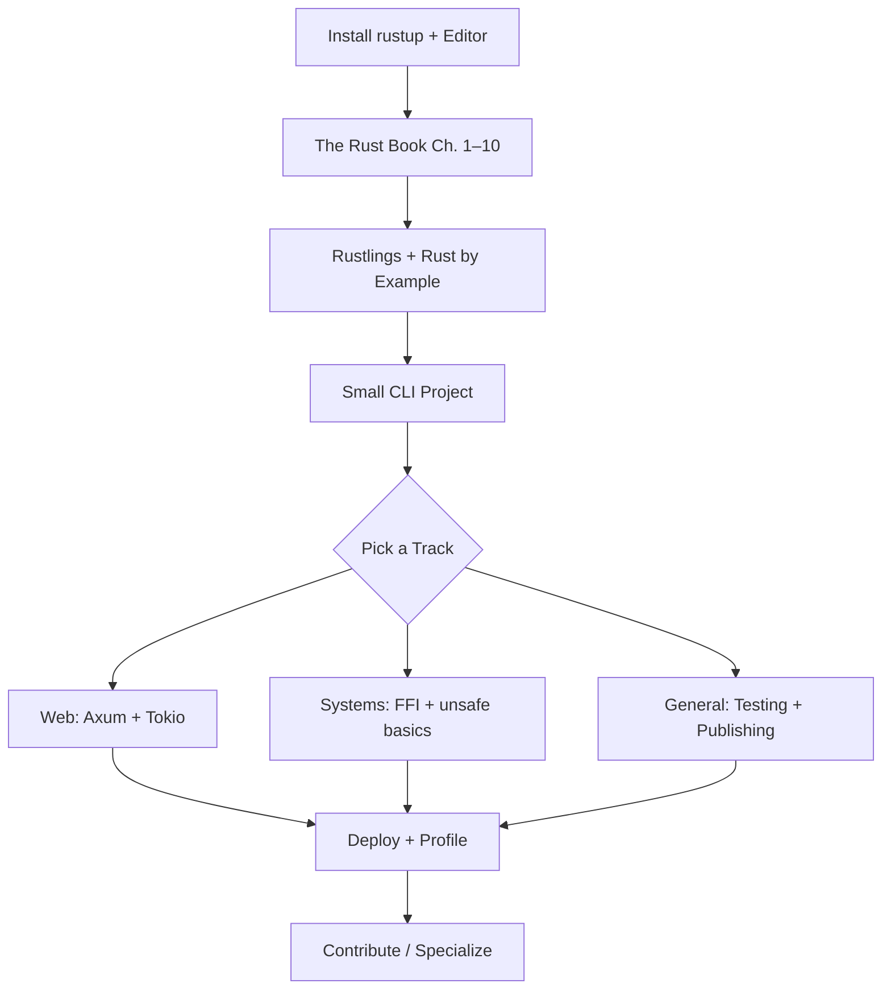

<div align="center">

# 🦀 Awesome Rust

**A curated, opinionated guide to learning, building, and shipping with Rust — from ownership basics to async systems programming.**

[](https://github.com/sindresorhus/awesome)
[](https://github.com/kirtiramchandani/awesome-resources)
[](https://github.com/kirtiramchandani/awesome-rust/stargazers)
[](https://github.com/kirtiramchandani/awesome-rust/network/members)
[](https://github.com/kirtiramchandani/awesome-rust/pulls)
[](https://creativecommons.org/publicdomain/zero/1.0/)
[](https://github.com/kirtiramchandani/awesome-rust)

*Part of the [Awesome Resources](https://github.com/kirtiramchandani/awesome-resources) ecosystem — focused lists, zero overwhelm.*

[Start Here](#-start-here) · [Why Rust](#-why-rust) · [Learning Path](#-learning-path) · [Official & Docs](#-official--docs) · [Contributing](#-contributing)

</div>

---

## ✨ What Is This?

**Awesome Rust** is a standalone, topic-focused list within the [Awesome Resources](https://github.com/kirtiramchandani/awesome-resources) hub. It collects high-quality Rust learning materials, official references, crates, frameworks, and communities — organized so you can go deep without drowning in links.

| This list **is** | This list **is not** |
| --- | --- |
| 🎯 A curated map of Rust's core ecosystem | 📦 A mirror of crates.io or every GitHub repo tagged `rust` |
| 🛤️ A learning path from beginner to advanced | 📋 A wholesale copy of rust-unofficial/awesome-rust |
| 🔗 Canonical links to official docs and trusted sources | 🔍 A substitute for reading crate documentation on docs.rs |

> **Let the borrow checker teach you. Then build software that cannot forget to free memory.**

---

## 📋 Table of Contents

- [Start Here](#-start-here)
- [Why Rust](#-why-rust)
- [Learning Path](#-learning-path)
- [Tag Legend](#-tag-legend)
- [Official & Docs](#-official--docs)
- [Beginner](#-beginner)
- [Intermediate](#-intermediate)
- [Advanced](#-advanced)
- [Ecosystem & Tools](#-ecosystem--tools)
- [Frameworks](#-frameworks)
- [Testing](#-testing)
- [Awesome Lists](#-awesome-lists)
- [Communities](#-communities)
- [Books](#-books)
- [Courses](#-courses)
- [Project Ideas](#-project-ideas)
- [Career](#-career)
- [Contributing](#-contributing)
- [License](#-license)

---

## 🚀 Start Here

Match your situation to a starting point. Each row links to a section in this README — open only what you need today.

| If you are… | Start with | Why |
| --- | --- | --- |
| 🆕 **Brand new to programming** | [Beginner](#-beginner) → [The Rust Book](#-official--docs) | Work through Rustlings alongside the Book — ownership clicks faster with hands-on drills |
| 🔄 **Switching from C/C++** | [Why Rust](#-why-rust) → [Rust by Example](#-official--docs) | You already know memory — focus on safe abstractions and the ownership model |
| 🌐 **Building a web API or service** | [Frameworks](#-frameworks) → [Testing](#-testing) | Axum or Actix with Tokio covers most async HTTP workloads teams ship today |
| ⚙️ **Writing systems or CLI tools** | [Ecosystem & Tools](#-ecosystem--tools) | Clap, serde, and cargo publish patterns appear in nearly every Rust binary project |
| 🧪 **Writing reliable code** | [Testing](#-testing) → [Intermediate](#-intermediate) | Built-in `cargo test` plus property testing catches bugs the borrow checker cannot |
| 🗺️ **Want a structured roadmap** | [Learning Path](#-learning-path) | Follow the staged path below from fundamentals to specialization |
| 🔍 **Looking for more links** | [Awesome Lists](#-awesome-lists) | Use rust-unofficial/awesome-rust for discovery; stay here for curated essentials |

**Hub navigation:** This list is one spoke in a larger wheel. When your focus shifts beyond Rust — system design, DevOps, WebAssembly, careers — return to the [Awesome Resources hub](https://github.com/kirtiramchandani/awesome-resources). Related lists: [awesome-c-cpp](https://github.com/kirtiramchandani/awesome-c-cpp) · [awesome-system-design](https://github.com/kirtiramchandani/awesome-system-design) · [awesome-go](https://github.com/kirtiramchandani/awesome-go)

---

## 🦀 Why Rust

Rust combines low-level control with compile-time memory safety. The ownership model eliminates entire classes of bugs — use-after-free, data races, null dereferences — without a garbage collector, which makes it attractive for systems software, high-performance services, and security-sensitive tooling.

### Strengths

| Strength | What it means in practice |
| --- | --- |
| **Memory safety without GC** | Predictable latency — no stop-the-world pauses from a runtime collector |
| **Expressive type system** | Enums, pattern matching, and traits model domain logic with compiler-checked exhaustiveness |
| **Fearless concurrency** | The borrow checker rejects data races at compile time — parallel code with fewer footguns |
| **cargo + crates.io** | Dependency management, testing, benchmarking, and publishing unified in one workflow |
| **Cross-compilation & WASM** | Ship native binaries, embedded firmware, browser modules, and server services from one toolchain |

### Trade-offs to know

| Trade-off | Honest take |
| --- | --- |
| **Steep initial curve** | Ownership, lifetimes, and trait bounds frustrate beginners — budget extra time for the first month |
| **Compile times** | Large projects can be slow to rebuild — use `cargo check`, workspace splits, and mold/sccache when needed |
| **Async complexity** | `async`/`.await` adds Pin, lifetimes, and executor choices — learn sync Rust thoroughly first |
| **Smaller hiring pool than Java/JS** | Demand is growing fast in infra and security, but fewer total openings than mainstream enterprise stacks |

### Where Rust shines

```
Systems & infrastructure  →  OS components, databases, proxies, embedded firmware
Web services              →  High-throughput APIs with Axum, Actix, or Rocket
CLI & developer tools     →  ripgrep, fd, bat — fast, polished binaries users love
WebAssembly               →  Browser and edge modules with near-native performance
Security-sensitive code   →  Parsers, crypto, sandboxes where memory bugs are unacceptable
```

Rust is not the fastest path to a CRUD prototype — but when correctness, performance, and long-term maintainability matter, it earns its learning investment.

---

## 🛤️ Learning Path

Follow one stage at a time. Depth beats breadth: finish a small project at each stage before jumping ahead.

### Path diagram



### Staged roadmap

| Stage | Focus | Time estimate | Key resources in this list |
| --- | --- | --- | --- |
| **0 — Setup** | Install rustup, run `rustc --version`, configure rust-analyzer | 1 hour | [rustup.rs](https://rustup.rs/), [rust-lang.org](https://www.rust-lang.org/) |
| **1 — Fundamentals** | Variables, ownership, borrowing, structs, enums, match | 2–3 weeks | [The Rust Book](#-official--docs), [Rustlings](#-beginner) |
| **2 — Idioms** | Traits, generics, error handling, modules, cargo | 2–3 weeks | [Rust by Example](#-official--docs), [Intermediate](#-intermediate) |
| **3 — First project** | Build a CLI tool or small library end-to-end | 1–2 weeks | [Project Ideas](#-project-ideas), [Ecosystem & Tools](#-ecosystem--tools) |
| **4 — Specialize** | Async web, embedded, WASM, or performance-critical code | 4–8 weeks | [Frameworks](#-frameworks), [Advanced](#-advanced) |
| **5 — Professional habits** | Clippy, CI, benchmarking, docs, open-source contribution | ongoing | [Testing](#-testing), [Career](#-career) |

### Track-specific forks

| Track | After Stage 3, prioritize | Capstone project idea |
| --- | --- | --- |
| **Web developer** | Tokio, Axum, serde, SQLx or Diesel | REST API with auth, integration tests, and a containerized deploy |
| **Systems programmer** | unsafe Rust basics, FFI, benchmarking | Native library with C bindings and documented safety invariants |
| **Tooling author** | Clap, tracing, cross-compilation | Published CLI on crates.io that solves one real developer workflow |
| **Async specialist** | Pin, streams, tower middleware | Concurrent service with backpressure, timeouts, and structured logging |

---

## 🏷️ Tag Legend

Tags appear in the **Tags** column of every resource table. Combine them to scan quickly for fit.

| Tag | Meaning |
| --- | --- |
| 🟢 | Beginner-friendly — minimal prerequisites |
| 🟡 | Intermediate — assumes comfortable Rust basics |
| 🔴 | Advanced — deep internals or expert-level material |
| 🆓 | Free to access |
| 💰 | Paid or primarily paid |
| 🛠 | Hands-on — exercises, labs, or project work |
| 📘 | Theory-heavy — concepts, language semantics, architecture |
| 🚀 | Project-based — build something end-to-end |
| ⭐ | Must-read — widely recommended anchor resource |
| 🔥 | Popular — large community adoption or high traffic |
| 🌐 | Official source — maintained by the Rust team or project owners |
| 📦 | Open source — source code freely available |
| ✅ | Verified — stable, actively maintained, canonical link |

**Level column values:** `Beginner`, `Intermediate`, `Advanced`  
**Cost column values:** `Free`, `Paid`, `Freemium`, `Open Source`

---

## 📚 Official & Docs

Start here for authoritative answers. When docs and blog posts disagree, trust these sources first.

| Resource | Type | Level | Cost | Why it matters | Tags |
| --- | --- | --- | --- | --- | --- |
| [rust-lang.org](https://www.rust-lang.org/) | Official site | Beginner | Free | Home for downloads, learning resources, governance, and community links — bookmark this first. | 🟢 🆓 🌐 ⭐ |
| [The Rust Programming Language (Book)](https://doc.rust-lang.org/book/) | Book (online) | Beginner | Free | The canonical narrative guide — read sequentially for the clearest mental model of ownership and traits. | 🟢 🆓 🌐 ⭐ |
| [Rust by Example](https://doc.rust-lang.org/rust-by-example/) | Reference | Beginner | Free | Runnable examples for every major feature — ideal alongside the Book when you learn by reading code. | 🟢 🆓 🌐 🛠 🔥 |
| [The Rust Reference](https://doc.rust-lang.org/reference/) | Reference | Advanced | Free | Formal language specification — consult when compiler errors reference subtle semantics. | 🔴 🆓 🌐 📘 |
| [Standard library docs (std)](https://doc.rust-lang.org/std/) | API reference | Intermediate | Free | Authoritative documentation for built-in types and traits — every Rust developer lives here daily. | 🟡 🆓 🌐 ⭐ |
| [docs.rs](https://docs.rs/) | API reference | Intermediate | Free | Hosted documentation for every published crate — the canonical browser for third-party library APIs. | 🟡 🆓 🌐 🔥 |
| [Rust Edition Guide](https://doc.rust-lang.org/edition-guide/) | Guide | Intermediate | Free | Explains changes across Rust editions — essential when migrating codebases or reading older tutorials. | 🟡 🆓 🌐 |
| [Rust RFC Book](https://rust-lang.github.io/rfcs/) | Reference | Advanced | Free | Design proposals and accepted RFCs — context for why language features exist and how they may evolve. | 🔴 🆓 🌐 📘 |

---

## 🌱 Beginner

Materials that assume no prior Rust experience. Pair reading with Rustlings exercises for faster progress.

| Resource | Type | Level | Cost | Why it matters | Tags |
| --- | --- | --- | --- | --- | --- |
| [Rustlings](https://github.com/rust-lang/rustlings) | Exercises | Beginner | Free | Small programs with failing tests that teach syntax and ownership — the community standard first drill set. | 🟢 🆓 📦 🛠 ⭐ |
| [Exercism — Rust Track](https://exercism.org/tracks/rust) | Exercises | Beginner | Free | Mentored practice problems with automated tests — reinforces Book chapters through repetition. | 🟢 🆓 🛠 |
| [Rust Playground](https://play.rust-lang.org/) | Tool | Beginner | Free | Compile and share snippets in the browser — experiment with types without a local project. | 🟢 🆓 🌐 🛠 |
| [Installation via rustup](https://www.rust-lang.org/tools/install) | Docs | Beginner | Free | Official installer for stable, beta, and nightly toolchains — verify with `rustc --version` before proceeding. | 🟢 🆓 🌐 ✅ |
| [Comprehensive Rust (Google)](https://google.github.io/comprehensive-rust/) | Course | Beginner | Free | Multi-day class material covering ownership through Android — dense but free and classroom-tested. | 🟢 🆓 🛠 🔥 |
| [Rust Crash Course (freeCodeCamp)](https://www.youtube.com/watch?v=zF34dRivLOw) | Video | Beginner | Free | Single-session overview for developers with prior programming experience — good preview before committing to the Book. | 🟢 🆓 |

---

## 📈 Intermediate

For developers who can compile working Rust but want idioms, error handling, and async foundations.

| Resource | Type | Level | Cost | Why it matters | Tags |
| --- | --- | --- | --- | --- | --- |
| [The Cargo Book](https://doc.rust-lang.org/cargo/) | Docs | Intermediate | Free | Definitive guide to manifests, workspaces, features, and publishing — required before sharing crates. | 🟡 🆓 🌐 ⭐ |
| [Rust API Guidelines](https://rust-lang.github.io/api-guidelines/) | Guide | Intermediate | Free | Official conventions for public crate APIs — read before publishing libraries others will depend on. | 🟡 🆓 🌐 📘 |
| [Error Handling in Rust](https://doc.rust-lang.org/book/ch09-00-error-handling.html) | Docs | Intermediate | Free | Book chapter on `Result`, `?`, and custom errors — the foundation for robust application code. | 🟡 🆓 🌐 |
| [serde](https://serde.rs/) | Library | Intermediate | Open Source | De-facto serialization framework — JSON, TOML, and binary formats across nearly every Rust project. | 🟡 📦 🔥 ⭐ |
| [Tokio Tutorial](https://tokio.rs/tokio/tutorial) | Tutorial | Intermediate | Free | Official async runtime guide — start here when HTTP services or concurrent I/O enter your projects. | 🟡 🆓 🛠 🔥 |
| [Clippy documentation](https://doc.rust-lang.org/clippy/) | Docs | Intermediate | Free | Built-in linter with hundreds of lints — run `cargo clippy` early to internalize idiomatic patterns. | 🟡 🆓 🌐 ✅ |

---

## 🔬 Advanced

Deep material for unsafe code, performance tuning, compiler internals, and library authors.

| Resource | Type | Level | Cost | Why it matters | Tags |
| --- | --- | --- | --- | --- | --- |
| [The Rustonomicon](https://doc.rust-lang.org/nomicon/) | Book (online) | Advanced | Free | Official guide to unsafe Rust, FFI, and subverting the borrow checker safely — read before writing `unsafe` blocks. | 🔴 🆓 🌐 📘 ⭐ |
| [Asynchronous Programming in Rust](https://rust-lang.github.io/async-book/) | Book (online) | Advanced | Free | Explains executors, `Future`, and Pin — bridges the gap between Tokio tutorials and production async services. | 🔴 🆓 🌐 📘 |
| [The rustc book](https://doc.rust-lang.org/rustc/) | Docs | Advanced | Free | Compiler flags, targets, and LTO — consult when build configuration affects production binaries. | 🔴 🆓 🌐 |
| [Rust Performance Book](https://nnethercote.github.io/perf-book/) | Book (online) | Advanced | Free | Profiling, allocation reduction, and LLVM-friendly patterns — turns benchmarks into measured wins. | 🔴 🆓 📘 🔥 |
| [Too Many Linked Lists](https://rust-unofficial.github.io/too-many-lists/) | Book (online) | Advanced | Free | Implements linked lists in Rust to teach ownership edge cases — painful, illuminating, and memorable. | 🔴 🆓 📘 🛠 |

---

## 🛠 Ecosystem & Tools

Daily-driver utilities that appear in professional Rust workflows.

| Resource | Type | Level | Cost | Why it matters | Tags |
| --- | --- | --- | --- | --- | --- |
| [cargo](https://doc.rust-lang.org/cargo/) | Build tool | Beginner | Free | Builds, tests, documents, and publishes crates — the center of every Rust project workflow. | 🟢 🆓 🌐 ⭐ |
| [rustup](https://rustup.rs/) | Toolchain manager | Beginner | Free | Installs and switches stable, beta, and nightly compilers — add components like clippy and rustfmt. | 🟢 🆓 🌐 ✅ |
| [rustfmt](https://github.com/rust-lang/rustfmt) | Formatter | Beginner | Open Source | Canonical code formatter — `cargo fmt` eliminates style debates in teams and open source. | 🟢 📦 🌐 |
| [rust-analyzer](https://rust-analyzer.github.io/) | LSP server | Beginner | Open Source | IDE intelligence for VS Code, Neovim, and JetBrains — go-to-definition and inline errors accelerate learning. | 🟢 📦 🔥 ⭐ |
| [Clap](https://docs.rs/clap/) | CLI framework | Intermediate | Open Source | Derive macros for subcommands and flags — powers most polished Rust command-line tools. | 🟡 📦 🔥 |
| [tracing](https://docs.rs/tracing/) | Logging | Intermediate | Open Source | Structured, async-aware instrumentation — replaces ad-hoc `println!` in production services. | 🟡 📦 |
| [Criterion.rs](https://github.com/bheisler/criterion.rs) | Benchmarking | Advanced | Open Source | Statistical benchmarking with HTML reports — use before claiming performance improvements. | 🔴 📦 🛠 |
| [crates.io](https://crates.io/) | Registry | Intermediate | Free | Official package registry — discover dependencies and publish your own crates with semver. | 🟡 🆓 🌐 🔥 |

---

## 🏗 Frameworks

Web servers, async runtimes, and application frameworks that shape most Rust backend projects.

| Resource | Type | Level | Cost | Why it matters | Tags |
| --- | --- | --- | --- | --- | --- |
| [Tokio](https://tokio.rs/) | Async runtime | Intermediate | Open Source | The dominant async executor for Rust — powers Axum, tonic, and most production network services. | 🟡 📦 🔥 ⭐ |
| [Axum](https://github.com/tokio-rs/axum) | Web framework | Intermediate | Open Source | Ergonomic HTTP framework from the Tokio team — tower middleware and type-safe extractors. | 🟡 📦 🔥 ⭐ |
| [Actix Web](https://actix.rs/) | Web framework | Intermediate | Open Source | High-performance actor-based HTTP server — mature ecosystem with extensive middleware options. | 🟡 📦 🔥 |
| [Rocket](https://rocket.rs/) | Web framework | Intermediate | Open Source | Opinionated web framework with codegen routing — approachable API for developers coming from Rails or Flask. | 🟡 📦 |
| [tonic](https://github.com/hyperium/tonic) | gRPC framework | Intermediate | Open Source | Async gRPC over Tokio — the Rust standard for protobuf-based microservice communication. | 🟡 📦 ⭐ |
| [hyper](https://hyper.rs/) | HTTP library | Advanced | Open Source | Low-level HTTP implementation underlying Axum and reqwest — study when you need custom protocol behavior. | 🔴 📦 📘 |
| [Leptos](https://leptos.dev/) | Web framework | Intermediate | Open Source | Full-stack framework with fine-grained reactivity — Rust frontend and server functions in one codebase. | 🟡 📦 🚀 |
| [SQLx](https://github.com/launchbadge/sqlx) | Database library | Intermediate | Open Source | Async, compile-time checked SQL — keeps raw queries with type safety without a heavy ORM. | 🟡 📦 🛠 ⭐ |

---

## 🧪 Testing

Rust embeds testing in the language and toolchain. These resources help you build confidence beyond `assert_eq!`.

| Resource | Type | Level | Cost | Why it matters | Tags |
| --- | --- | --- | --- | --- | --- |
| [Testing chapter (Rust Book)](https://doc.rust-lang.org/book/ch11-00-testing.html) | Docs | Beginner | Free | Unit tests, integration tests, and `#[should_panic]` — the official foundation every project builds on. | 🟢 🆓 🌐 ⭐ |
| [cargo test](https://doc.rust-lang.org/cargo/commands/cargo-test.html) | Docs | Beginner | Free | Runs unit, integration, and doc tests — learn flags for filtering, threading, and nightly features. | 🟢 🆓 🌐 |
| [proptest](https://github.com/proptest/proptest) | Library | Intermediate | Open Source | Property-based testing that generates edge-case inputs — catches bugs table-driven tests miss. | 🟡 📦 🛠 |
| [mockall](https://github.com/asomers/mockall) | Mock library | Intermediate | Open Source | Generates mocks from traits — isolates units when external services need test doubles. | 🟡 📦 |
| [cargo-nextest](https://nexte.st/) | Test runner | Intermediate | Open Source | Faster parallel test execution with better reporting — drop-in replacement for `cargo test` in CI. | 🟡 📦 🔥 |

---

## 📚 Awesome Lists

Broader discovery indexes — use them after this list when you need exhaustive category coverage.

| Resource | Type | Level | Cost | Why it matters | Tags |
| --- | --- | --- | --- | --- | --- |
| [rust-unofficial/awesome-rust](https://github.com/rust-unofficial/awesome-rust) | Awesome list | Intermediate | Free | The largest community Rust index — crates, tools, and applications; great for discovery, not curation. | 🟡 🆓 🔥 ⭐ |
| [Awesome Resources (hub)](https://github.com/kirtiramchandani/awesome-resources) | Awesome list | Beginner | Free | Parent navigation repo linking language and domain lists — return here when your focus shifts beyond Rust. | 🟢 🆓 ⭐ |
| [Awesome C / C++](https://github.com/kirtiramchandani/awesome-c-cpp) | Awesome list | Intermediate | Free | Companion list for low-level programmers comparing Rust with C and C++ ecosystems. | 🟡 🆓 |

---

## 👥 Communities

Places to ask questions, share projects, and learn what teams ship in production.

| Resource | Type | Level | Cost | Why it matters | Tags |
| --- | --- | --- | --- | --- | --- |
| [Rust Users Forum](https://users.rust-lang.org/) | Forum | Beginner | Free | Official community forum — searchable threads on beginners, embedded, async, and library design. | 🟢 🆓 🌐 ⭐ |
| [Rust Internals](https://internals.rust-lang.org/) | Forum | Advanced | Free | Design and compiler discussions — follow when you want early signal on language direction. | 🔴 🆓 🌐 |
| [r/rust](https://www.reddit.com/r/rust/) | Forum | Intermediate | Free | News, Show HN-style projects, and weekly help threads — active but read rules before posting homework. | 🟡 🆓 🔥 |
| [This Week in Rust](https://this-week-in-rust.org/) | Newsletter | Intermediate | Free | Curated articles, crate releases, and call-for-participation — low-effort way to stay current. | 🟡 🆓 🔥 |
| [RustConf](https://rustconf.com/) | Conference | Intermediate | Paid | Flagship Rust conference — recorded talks set community expectations for idioms and tooling. | 🟡 💰 📘 |

---

## 📖 Books

Books reward sustained focus. These titles cover beginner through expert tiers without redundant overlap.

| Resource | Type | Level | Cost | Why it matters | Tags |
| --- | --- | --- | --- | --- | --- |
| [Programming Rust (2nd ed.)](https://www.oreilly.com/library/view/programming-rust-2nd/9781492052590/) | Book | Intermediate | Paid | Comprehensive reference from O'Reilly — strong after finishing the official Book for production depth. | 🟡 💰 📘 ⭐ |
| [Rust in Action](https://www.manning.com/books/rust-in-action) | Book | Intermediate | Paid | Systems programming focus with hands-on projects — ideal for developers who learn by building. | 🟡 💰 🛠 🚀 |
| [The Rust Programming Language (print ed.)](https://nostarch.com/rust-programming-language-2nd-edition) | Book | Beginner | Paid | Print edition of the official Book — supports the free online version with offline reading. | 🟢 💰 🌐 |
| [Zero To Production In Rust](https://www.zero2prod.com/) | Book | Intermediate | Paid | End-to-end web service with tests, telemetry, and deploy — bridges tutorials to production habits. | 🟡 💰 🚀 ⭐ |
| [Rust for Rustaceans](https://nostarch.com/rust-rustaceans) | Book | Advanced | Paid | Idiomatic patterns for experienced Rust developers — read after a year of daily Rust for maximum payoff. | 🔴 💰 📘 |

---

## 🎬 Courses

Structured courses complement docs and books — especially when video and assignments match your learning style.

| Resource | Type | Level | Cost | Why it matters | Tags |
| --- | --- | --- | --- | --- | --- |
| [Comprehensive Rust (Google)](https://google.github.io/comprehensive-rust/) | Course | Beginner | Free | Four-day classroom material with exercises — one of the best free structured paths available. | 🟢 🆓 🛠 ⭐ |
| [Rustlings + Book pairing](https://github.com/rust-lang/rustlings#runnable-exercises) | Self-paced | Beginner | Free | Official recommendation: alternate Book chapters with Rustlings drills — built-in progression without a paywall. | 🟢 🆓 🛠 |
| [Let's Get Rusty (YouTube)](https://www.youtube.com/c/LetsGetRusty) | Video | Beginner | Free | Weekly videos on language features, crates, and news — approachable supplement to the Book. | 🟢 🆓 |
| [Boot.dev — Learn Rust](https://www.boot.dev/courses/learn-rust) | Course | Beginner | Freemium | Interactive exercises with automated grading — builds syntax fluency before async complexity. | 🟢 🆓 💰 🛠 |

---

## 💡 Project Ideas

Build to learn. These ideas scale from weekend CLIs to portfolio-worthy services.

| Project | Type | Level | Cost | Why it matters | Tags |
| --- | --- | --- | --- | --- | --- |
| **grep clone** | Project idea | Beginner | Free | Line-by-line file search with regex — teaches iterators, `Result`, and CLI args without async. | 🟢 🛠 🚀 ⭐ |
| **JSON pretty-printer** | Project idea | Beginner | Free | Read stdin, parse with serde_json, print formatted output — introduces derive macros and error propagation. | 🟢 🛠 🚀 |
| **Todo REST API** | Project idea | Intermediate | Free | Axum + SQLx with CRUD routes — classic intro to async handlers, database pools, and integration tests. | 🟡 🛠 🚀 |
| **Markdown static site generator** | Project idea | Intermediate | Free | Parse front matter, render HTML templates — practices filesystem I/O, modules, and crate structure. | 🟡 🛠 🚀 |
| **Concurrent download accelerator** | Project idea | Intermediate | Free | Tokio tasks fetching URL chunks — practices channels, semaphores, and `JoinSet` patterns. | 🟡 🛠 🚀 |
| **gRPC calculator service** | Project idea | Intermediate | Free | tonic server and client with protobuf — introduces contract-first APIs across two crates. | 🟡 🛠 🚀 |
| **WASM canvas demo** | Project idea | Advanced | Free | Compile Rust to WebAssembly for browser graphics — explores a second deployment target beyond native binaries. | 🔴 🛠 🚀 |
| **Publish a crates.io library** | Project idea | Advanced | Free | Document public API, set up CI, tag semver releases — completes the open-source author loop. | 🔴 🛠 🚀 ⭐ |

---

## 💼 Career

Rust skills open doors in infrastructure, security, blockchain-adjacent systems, and performance-critical backends.

| Resource | Type | Level | Cost | Why it matters | Tags |
| --- | --- | --- | --- | --- | --- |
| [Rust Jobs](https://rustjobs.dev/) | Job board | Intermediate | Free | Curated Rust-focused listings — smaller volume than mainstream boards but higher signal per posting. | 🟡 🆓 🔥 |
| [Awesome Learning & Career (hub list)](https://github.com/kirtiramchandani/awesome-learning-career) | Awesome list | Beginner | Free | Interview prep, portfolios, and career roadmaps — companion list when Rust skills are ready for the job market. | 🟢 🆓 ⭐ |
| [Rust Foundation](https://foundation.rust-lang.org/) | Organization | Intermediate | Free | Stewardship body for the language — sponsor memberships and governance context for enterprise adoption stories. | 🟡 🆓 🌐 |
| [Rust Contributor Guide](https://rustc-dev-guide.rust-lang.org/) | Guide | Advanced | Free | Contributing to the compiler or stdlib is a strong credibility signal — follow the official dev guide. | 🔴 🆓 🌐 🚀 |

### Role → skill map

| Role | Rust skills to emphasize | Sections to revisit |
| --- | --- | --- |
| **Backend engineer** | Axum/Tokio, SQLx, testing, observability | [Frameworks](#-frameworks), [Testing](#-testing) |
| **Systems programmer** | unsafe basics, FFI, benchmarking, embedded | [Advanced](#-advanced), [Ecosystem & Tools](#-ecosystem--tools) |
| **Infrastructure / platform** | CLIs, cross-compilation, performance profiling | [Ecosystem & Tools](#-ecosystem--tools), [Advanced](#-advanced) |
| **Open-source maintainer** | API guidelines, semver, docs.rs, CI | [Intermediate](#-intermediate), [Contributing](#-contributing) |

---

## 🤝 Contributing

Contributions keep this list accurate and useful. Please read the full **[CONTRIBUTING.md](CONTRIBUTING.md)** before opening a PR.

### Quick guidelines

- **Add resources to the correct section** in this README — we do not split content across separate category files.
- **Use canonical URLs** (`doc.rust-lang.org`, `docs.rs`, official project sites).
- **Write original descriptions** — one concise sentence explaining why the resource matters; do not copy from other awesome lists.
- **Include all table columns:** Resource, Type, Level, Cost, Why it matters, Tags.
- **No duplicates** — search the README before adding; link to an existing entry instead.
- **Quality bar:** Include resources you'd recommend to a colleague — skip promotional or affiliate-only pages.

### Contribution checklist

- [ ] Link is active and points to the canonical source
- [ ] Description is original and useful
- [ ] Category, level, cost, and tags are correct
- [ ] No duplicate of an existing entry
- [ ] Resource is Rust-focused and high quality

---

## 📄 License

[](https://creativecommons.org/publicdomain/zero/1.0/)

This work is dedicated to the public domain under the [CC0 1.0 Universal](https://creativecommons.org/publicdomain/zero/1.0/) license.

You are free to use, modify, and distribute this content without attribution — though credit is always appreciated.

Individual linked resources maintain their own licenses. Always check the source before reusing content.

---

<div align="center">

**⭐ Star this repo if it helped you. Upstream PRs welcome.**

*Curated for learners and builders who want depth — not another link dump.*

[⬆ Back to top](#-awesome-rust) · [🌐 Awesome Resources Hub](https://github.com/kirtiramchandani/awesome-resources)

</div>
